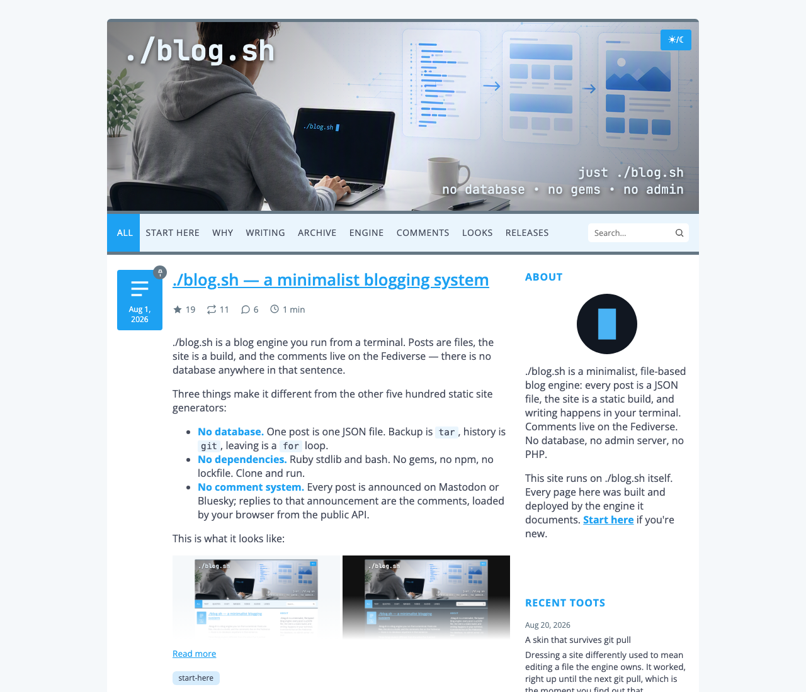
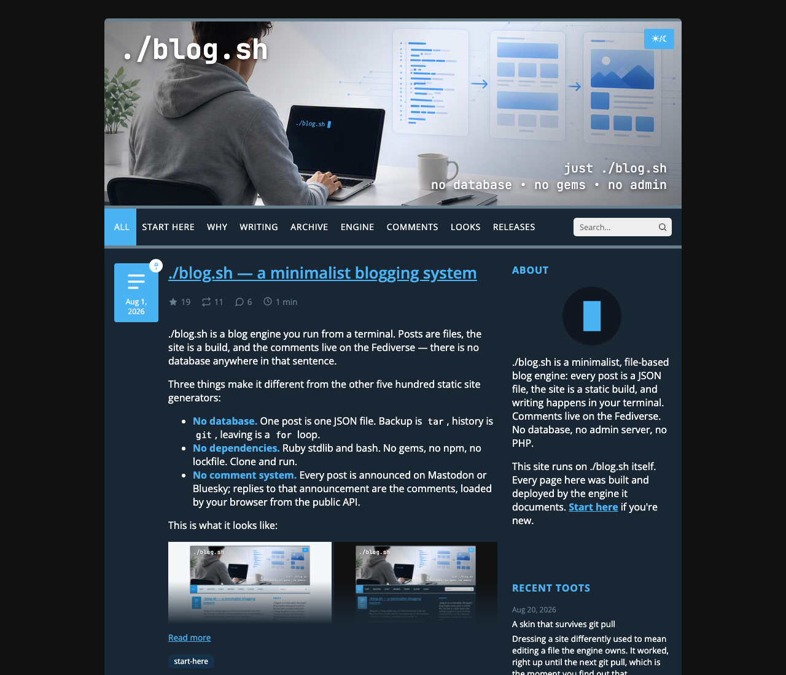

# blog.sh — .sh → .rb → .html


*minimalistic static web/log cms*

[](https://opensource.org/licenses/MIT)
[](https://www.gnu.org/software/bash/)
[](https://www.ruby-lang.org)
[](https://www.json.org)
[](https://developer.mozilla.org/en-US/docs/Web/HTML)
[](https://developer.mozilla.org/en-US/docs/Web/CSS)
[](https://joinmastodon.org)
[](https://bsky.social)

A minimalist, file-based web/log engine. Posts are plain JSON files, the
site is a static build, and authoring happens through a CLI/wizard --
no database, no admin server, no PHP.

**See it running:** [blogsh.app](https://blogsh.app) is this engine
publishing its own documentation -- every page there was built and
deployed by `./blog.sh` itself.

MIT licensed (see [LICENSE](LICENSE)).

> **Who it's for:** one person writing their own blog, at home in a
> terminal, who wants to own the whole archive -- including everything
> they already wrote somewhere else. Twenty-two
> [import sources](#importing-existing-content) bring it in, from a
> WordPress export to a blog whose platform no longer exists. It deploys
> to Surfer, rsync, git-pages, rclone, SFTP or a local directory.
>
> **Who it isn't for:** several authors sharing one site, anyone who
> needs a web admin interface, or a workflow where publishing isn't a
> command. It grew around a single deployment
> ([sean.cz](https://sean.cz)) and still fits that shape best, but it
> installs and runs as-is -- `setup.sh` asks the questions, and
> [blogsh.app](https://blogsh.app) is a second site running the same
> unmodified engine.

| Light | Dark |
| --- | --- |
|  |  |

*The default blue palette -- both modes come entirely from the 7-key
`colors:` section in `config/site.yml` (see
[install.md → The palette and the header's type](docs/install.md#the-palette-and-the-headers-type)).*

**Contents:** [Why this exists](#why-this-exists) ·
[What it does](#what-it-does) · [Stack](#stack) · [Structure](#structure) ·
[Requirements](#requirements) · [Getting started](#getting-started) ·
[Authoring](#blogsh----authoring) ·
[Configuration](#configuration-envsh-per-deployment-never-in-git) ·
[Importing existing content](#importing-existing-content) ·
[Exporting](#exporting) ·
[Deploy](#deploy) · [Roadmap](#roadmap) ·
[Example deployments](#example-deployments)

## Why this exists

Most static-site generators solve the general case, then make you
configure your way back to something specific. `blog.sh` runs the other
direction: it started from one very specific workflow (write on a phone or
a laptop, publish from a terminal, comments live on Mastodon or
Bluesky, nothing
ever calls out to a third-party JS SDK) and grew a CLI, a build, and a
deploy step around exactly that. A few of the choices that came out of it:

- **Posts are typed content blocks, not a Markdown blob rendered at
  request time.** You write Markdown; on save it's parsed once into a
  structured block format (paragraph, heading, quote, list, table, code,
  image, video, audio, chat, link, divider) -- the same schema the historical
  Tumblr/Twitter imports also normalize into. The build never re-parses
  Markdown, and any future importer just has to target one schema.
- **Comments without a comment system.** Every published post is
  auto-announced on Mastodon *or* Bluesky (the site picks exactly one);
  replies to that announcement *are* the comments. The client fetches
  the thread from the network's public API at render time -- no database
  of comments to moderate or migrate, and the "comment count" next to a
  post is just the reply count on its announcement. Optionally, only the
  replies you favourite are published (`comments.approval: fav`) -- the
  moderation interface is the app on your phone.
- **Deploys default to paranoid.** `scripts/deploy-web.sh` diffs a SHA-256 +
  size + mtime manifest so it only ships what changed, and refuses to
  proceed if the file count or the total bytes swing too far versus the last
  build it accepted -- a bad `--prune` run can't silently empty your site.
  A single file too large for the strictest supported target is refused when
  the post is saved, not discovered at deploy time.
- **Nothing renders that wasn't asked for.** Sidebar widgets (toots,
  Pixelfed posts, commits, per-post stats) are fetched server-side on a
  cron, never by the visitor's browser -- so there's no client-side call
  to a third party on every page load, and no widget can slow down or
  break the page for a visitor.

Concretely: **Hugo and Jekyll** are build steps, **Ghost** is a server
with a database and an admin interface. `blog.sh` is the third shape --
the build *and* the authoring tool *and* the deploy step in one, with
the database replaced by a directory of JSON files and the comment
system by a social network you already post to. What you give up is a
theme ecosystem, plugins, and more than one author.

## What it does

A tour rather than a reference -- each part says where it is described in
full.

**Content.** One post is one JSON file
(`content.nosync/posts/<year>/<slug>.json`), and its text is a list of
typed blocks -- paragraph, heading, quote, list, table, code, image,
video, audio, chat, link, divider -- rather than a Markdown blob
re-parsed on every build. Inline formatting is stored as offsets into
plain text, not nested HTML. Media lives locally next to its post, never
hotlinked, and a photo loses the place it was taken on the way in --
`media.strip_location`, on unless you turn it off, and only the location:
the camera, the moment and the tag that keeps a portrait photo standing up
all stay. A post is either published or a draft, a draft has an
unguessable preview URL, a published post can be pinned to the front
page, and a post built around a file is filed as a document with a
download card. A post's header can also say which series it belongs to,
whether it wants a table of contents, and whether its lead image runs full
width above the title; every card and every post page says how long the
post takes to read.
→ [architecture.md → Content model](docs/architecture.md#content-model)

**Writing.** `./blog.sh` is a CLI, and run bare an interactive menu: add,
edit, publish, schedule, unpublish, delete and restore, (re-)send an
announcement, rename a slug without breaking the old address -- it stays
on the site as a permanent redirect -- and browse the archive on screen,
with filters, previews and a live search that speaks the same query
language as the site's own box. Nothing publishes blind: every public or
destructive step shows a preview and asks first. With `publishing.slots`
configured, drafts written in one sitting queue onto consecutive slots
instead of going out together, and `./blog.sh queue` works that queue as
one screen. A post written over SSH opens on your phone from the QR code
the wizard prints. The complete command list is under
[`blog.sh` -- authoring](#blogsh----authoring) below.
→ [operations.md → Writing and publishing](docs/operations.md#writing-and-publishing)

**Markdown.** One parser (`lib/markdown_parser.rb`), shared by the build
and the authoring tool: headings, the usual inline marks, titled and bare
links, ordered, nested and task lists, blockquotes with attribution, chat
transcripts, fenced code with a language hint, aligned tables, images,
video, audio, file attachments, backslash escaping. A platform's own
address becomes its player from the address alone -- YouTube, Vimeo,
PeerTube and archive.org as video, Spotify, SoundCloud and Mixcloud as
audio -- storing a provider and an id, never the platform's embed code.
The syntax reference at `/markdown/` is rendered through this same
parser, so every example on it behaves exactly as it would in a post.
→ [architecture.md → The markdown round-trip](docs/architecture.md#the-markdown-round-trip)

**Build.** Static HTML from JSON through ERB templates, no framework:
pagination anchored to the oldest post so page boundaries stay stable as
new posts arrive, tag, series and content-type archives that exist only
for the tags, series and types the site actually has, RSS, a sitemap,
`robots.txt`, a generated `/favicon.ico`, a 404 page wearing the site's
own chrome instead of the host's default, and a search index split into an
eager recent half and a lazily loaded archive. Search itself is entirely
client-side -- quoted
phrases, `-word` exclusion, diacritics never deciding a match. Only
changed files are written, and whatever the build didn't produce this run
is removed afterwards.
→ [architecture.md → Build pipeline](docs/architecture.md#build-pipeline-buildbuild_blogrb)

**Finding what is there.** `/archive/` is a map of the whole site in two
levels: a row per year with a strip of twelve months, and a page per year
listing every post by month -- an index, not another listing, with no
excerpts and no pictures, because the point is to see the shape of twenty
years at once. Pagination cannot show that: it is anchored to the oldest
post, so `/page/128/` says nothing about which year it holds. `/tag/`
is the other half: every tag the site has, as pills, with how often each
was used, alphabetically or by count. A post's date badge links into the
month it belongs to.
→ [operations.md → Reading the archive](docs/operations.md#reading-the-archive)

**What a listing card shows.** A card is cut before it is written rather
than drawn in full and hidden with CSS: blocks are kept while they fit a
budget of roughly five hundred pixels, the first one always, and nothing
is ever half-shown. A post can decide for itself instead -- a line reading
`//--more--//` splits it into what it says about itself and what it
actually says, and then the card, the link card and the announcement take
the first half. A "read more" link appears exactly when something did not
fit.
→ [markdown cheat sheet → Teaser](templates/markdown-cheat-sheet.en.md)

**Code blocks carry a copy button.** Built by the page's own script, so a
browser that runs no JavaScript shows no dead control, and never offered
where the clipboard cannot be reached -- an `http://` install, or a
browser without it. On a listing card, where the block may have been cut
to fit, there is no button: half a script copied silently is worse than
none.

**Deploy.** `scripts/deploy-web.sh` over a pluggable backend: Cloudron
Surfer, a local directory, rsync over SSH, a git-pages snapshot push, any
rclone remote, or plain SFTP. A SHA-256 + size + mtime manifest means
only what changed is uploaded, and the guards refuse to proceed when the
file count or the total bytes swing too far against the last build a
deploy accepted -- so a bad `--prune` can't quietly empty the site.
→ [install.md → Pick a deploy target](docs/install.md#6-pick-a-deploy-target),
[the commands](#deploy)

**Comments, without a comment system.** The announcement's replies are
the thread and `comments.approval: fav` publishes only the ones you
favourite -- both told in full under [Why this exists](#why-this-exists),
and told once.
→ [install.md → Comments network](docs/install.md#8-comments-network-optional-mastodon-or-bluesky)

**Sidebar widgets.** Latest toots, Bluesky posts, Pixelfed posts, GitHub
commits, any RSS/Atom feed, and per-post stats -- each independently
optional, all fetched server-side on a cron. The visitor's browser never
calls a third party for them, so no widget can slow down or break a page.
→ [operations.md → Cron](docs/operations.md#cron-sidebar-widgets-and-post-stats)

**Appearance.** Light and dark from CSS custom properties and
`prefers-color-scheme`, with a toggle that cycles through three states --
follow the system, light, dark -- so a reader who tries the other mode can
hand the decision back; a lightbox, collapsible
mobile navigation, and photo galleries assembled from adjacent images.
The menu bar follows the reader down the page, so the way out of an
article is wherever they finished it rather than back at the top, and it
carries the search field on a phone as well as on a desktop.
The whole palette is seven config keys per mode, compiled into a
stylesheet at build time -- ready-made palettes ship with the engine,
and the header's typeface and size are configuration too, not a file to
edit. The site's own words -- the bio in the sidebar, the note and
the copyright line in the footer, the claim over the banner -- are written
in the same Markdown a post is, and raw HTML still works in them, which is
how a photo gets into a bio. No framework anywhere; the JavaScript is
small single-purpose files.
→ [install.md → The palette and the header's type](docs/install.md#the-palette-and-the-headers-type)

**Reachable without a mouse, and quiet if you ask.** One focus ring for
the whole site, in the site's own accent, so a reader moving by keyboard
can always see where they are -- and it goes inside the control wherever
the ground behind it is a photograph or a fill it would disappear into.
The lightbox opens with Enter, walks with the arrows, keeps Tab inside
itself while it is up and hands focus back to the picture it was opened
from; the menu on a phone closes with Escape or a tap on the page. Every
page has exactly one `h1`. A reader whose system asks for less movement
gets the site with its transitions off and the back-to-top button putting
them at the top rather than travelling there.
→ [decisions.md](docs/decisions.md)

**Security.** A Content-Security-Policy on every page, self-hosted fonts,
no third-party tracking in post data, consistent escaping of everything
that came off a network, and `env.sh` out of git at mode `600`.
→ [architecture.md → Security](docs/architecture.md#security)

**Importing.** Twenty-two sources through `./import.sh`, which always
previews in dry-run and makes you confirm before it writes anything.
Imports land in the same block schema as hand-written posts with their
media downloaded locally, so an imported post is indistinguishable from
one you typed, and re-running an import overwrites in place rather than
duplicating. Sources that know their posts' original URLs can record
them, and the built site then answers at every old path.
→ [the source table](#importing-existing-content),
[importing.md](docs/importing.md)

## Stack

- **Build:** Ruby (`build/build_blog.rb`)
- **Authoring:** a Ruby CLI/wizard (`scripts/manage_post.rb`, run via `./blog.sh`)
- **Templates:** ERB (`templates/`)
- **i18n:** `locales/*.yml` + `lib/i18n.rb` -- ships with English (default),
  Czech and German; add another `locales/<code>.yml` for a different
  language, missing keys fall back to English
- **Deploy:** pluggable backends (`lib/deploy_backend/`) -- Cloudron
  Surfer (Files API), a local directory, rsync, git-pages, rclone, or
  SFTP; `scripts/deploy_web.rb`
- **Sidebar widgets:** entirely optional, `lib/*_fetcher.rb` + `lib/sidebar.rb`

## Structure

```
blog.sh                  Main tool -- CLI and interactive wizard (see below)
setup.sh                 Setup wizard -- identity, address, comments network, deploy target
style.sh                 Appearance wizard -- palette, banner, menu, about, footer, sidebar
import.sh                Import wizard -- pick a source, preview, confirm (see below)
build/                   Build script (JSON posts -> static HTML)
scripts/                 Ruby CLI, import/deploy scripts, and their .sh wrappers:
                           deploy-web.sh      standalone deploy of public.nosync/ to the configured target (no rebuild)
                           refresh-sidebar.sh cron: refreshes only the sidebar widgets (no site rebuild)
                           migrate_*.rb       one per import source, scriptable alternative to import.sh
lib/                     Shared Ruby libraries (Surfer client, fetchers, post writer, i18n, ...)
lib/import/              Import adapters plus the layer they share (media, run, CLI)
locales/                 UI strings for the generated site and the CLI (en.yml, cs.yml, de.yml)
templates/               ERB templates (layout, post, index, search, partials)
                         + markdown-cheat-sheet.<lang>.md, the /markdown/ page's source
assets/                  CSS/JS/fonts (drop your own images into assets/images/)
config/site.yml.example  Documented config template -- copy to config/site.yml (gitignored) per deployment
env.sh.example           Documented secrets/env template -- copy to env.sh (gitignored) per deployment
docs/                    Install & operations guides, plus this README's screenshots

content.nosync/, media.nosync/, public.nosync/, incoming/, trash/, drafts/, env.sh, config/site.yml
                         Per-deployment/generated, not part of the engine -- see .gitignore
```

`content.nosync/posts/` (the posts themselves) and `media.nosync/` (their
images/videos) are deliberately **not** part of this repo: they're personal
content, not code, specific to whoever deploys this engine for their own
site. Likewise `config/site.yml` -- only the documented
`config/site.yml.example` template is committed. The `.nosync` suffix also
excludes both directories from iCloud sync on a Mac; on a server, where
iCloud doesn't exist, it's just a name.

## Requirements

- **Ruby 2.7+** (3.x recommended), standard library only -- no gems, no Bundler, nothing to
  install. One caveat: the optional Pixelfed/RSS sidebar widgets use
  `rexml`, a Ruby *default gem* (ships with a normal Ruby install, but
  some distro package splits leave it out -- see
  [install.md](docs/install.md#what-you-need) if `gem install rexml`
  is ever needed). Importing needs it for real: every XML source --
  WordPress, Blogger, Squarespace, podcasts, any RSS or Atom feed, the
  Wayback rescue and LiveJournal -- reads through `rexml`
- **bash** (the thin `blog.sh` / `deploy-web.sh` / `refresh-sidebar.sh` wrappers)
- Optional, per integration: somewhere to deploy to (a
  [Cloudron Surfer](https://cloudron.io) app, any rsync/SSH host, a
  GitHub/GitLab/Codeberg Pages branch, an rclone remote, or just a local
  directory served by your own web server), a Mastodon or Bluesky
  account for comments and the auto-announcement, cron for the sidebar
  widgets -- and, only if you turn on `media.convert_heic` (converting
  iPhone HEIC photos to JPEG on save), an image tool the machine
  typically already has: `sips` (built into macOS), `heif-convert`,
  ImageMagick or vips. Off by default; without a tool the engine refuses
  the file with instructions instead of breaking

## Getting started

Coming from zero on macOS, Linux or Windows? There's a complete
copy-paste path per platform -- Ruby included -- in
[docs/install.md → Quick start](docs/install.md#quick-start). The steps
below assume Ruby 2.7+ is already on the machine:

1. `./setup.sh` -- it asks for the site's title, description, timezone,
   address, comments network (Mastodon or Bluesky) and deploy target,
   checks each answer as you give it, and writes `config/site.yml` and
   `env.sh`. Every question can be skipped, nothing is written until you
   have seen the diff and confirmed it, and re-running it is how you
   change any of this later.

   Prefer to do it by hand? Copy `config/site.yml.example` to
   `config/site.yml` and `env.sh.example` to `env.sh` (`chmod 600
   env.sh`) and edit them; both are fully commented, an unedited pair is
   already a working local site, and the wizard writes the same files
   without disturbing a line you wrote yourself.
2. `./style.sh` for how it looks and what it says about itself: the
   palette (seven ship with the engine, so it is one keystroke rather
   than fourteen hex values), the banner image (copied into place and
   measured, so its declared size can't drift from the file), your bio,
   the footer, the social icons and the sidebar widgets. A menu, so you
   can come back to one section without walking through the rest.
3. `./blog.sh doctor` any time you want to know whether the
   configuration is sound -- it reads what is on disk and reports every
   problem at once, in whole sentences, including the ones that fail
   silently (a timezone typo, a banner whose declared size no longer
   matches the file, a sidebar widget that can never show anything).
4. The favicon is the one piece of artwork no wizard handles: replace
   `assets/images/favicon.png` with your own. Both it and the banner
   ship as defaults (`assets/images/defaults/`, copied to any missing
   live name at build time), so a fresh clone renders before you've
   drawn anything, and the live names are gitignored so your artwork
   survives `git pull` -- which also means nothing else keeps a copy, so
   put both in your backup.
5. `./blog.sh add` to write your first post.
6. `ruby build/build_blog.rb` to build, or `./blog.sh rebuild` to build and deploy.
7. `./blog.sh preview` to look at it locally before deploying anywhere
   (serves `public.nosync/` at `http://localhost:8000`, Ctrl-C stops it).

Every integration beyond the core (analytics, each sidebar widget,
comments and the auto-announcement on Mastodon or Bluesky) is optional
and activates only when its
config section is present -- a minimal `site.yml` with just `site` and
`banner` is a complete, working site; `about` and `footer` are worth
filling in, but an emptied section simply leaves the page.

That's the short path. The complete one -- server install, every deploy
backend step by step, the phone workflow, the comments-network setup -- is
[docs/install.md](docs/install.md); day-to-day usage (publishing,
cron, backup, troubleshooting) is
[docs/operations.md](docs/operations.md). What changed between versions --
and whether an upgrade is urgent for you -- is [CHANGELOG.md](CHANGELOG.md);
`./blog.sh version` says what you are running.

## `blog.sh` -- authoring

```bash
./blog.sh                      # interactive wizard (menu)
./blog.sh add                  # creates a draft, shows a preview, asks what's next
./blog.sh edit [<slug>]        # without a slug, offers the last 50 posts
./blog.sh props [<slug>]       # a post's state + actions (publish, rename the slug, delete...)
./blog.sh publish [<slug>]     # shows the draft's preview, asks what's next
./blog.sh schedule [<slug>]    # asks for a date, then auto-publishes the draft when it arrives
./blog.sh unpublish [<slug>]   # moves a published post back to draft (also deletes its announcement)
./blog.sh delete [<slug>]      # deletes a post to trash/
./blog.sh restore [<slug>]     # restores a post from trash
./blog.sh toot [<slug>]        # (re-)sends the comment toot (Mastodon sites)
./blog.sh bluesky [<slug>]     # (re-)sends the announcement (Bluesky sites)
./blog.sh rebuild [--full]     # rebuilds and deploys the whole site;
                               # --full builds every page again instead of only the changed ones
./blog.sh preview [<port>]     # serves public.nosync locally (default 8000)
./blog.sh browse [--type=image] [--tag=foo] [--drafts]
                               # the archive on screen: filters, search, preview, Enter opens the post
./blog.sh list [--type=image] [--tag=foo] [--drafts]
                               # the same, printed one line per post
./blog.sh doctor [--online]    # reads the configuration and says what is wrong with it
./blog.sh doctor --strip-location
                               # removes the place of capture from photos already in the archive
./blog.sh check [--online] [--json] [--repair]
                               # walks the archive and says what is broken in it;
                               # --json prints every finding as data instead of a screenful;
                               # --repair offers, per finding, the one repair that finding allows
./blog.sh export [<dir>] [--no-drafts] [--dry-run] [--force]
                               # writes the whole archive out as a tree of markdown files
./blog.sh stats [--json]       # counts the archive: posts by year and kind, words, tags, media, sources
./blog.sh version              # which version this installation is running
./blog.sh help
```

## Configuration (`env.sh`, per-deployment, never in git)

Copy [`env.sh.example`](env.sh.example) to `env.sh` (gitignored) and fill it
in -- `chmod 600 env.sh`, since it holds live credentials. It lives wherever
the site is built from: on a server for a deployed site, or just on your
laptop for a local one.

```bash
export SITE_BASE_URL=https://example.com
export MASTODON_ACCESS_TOKEN=...   # comment toots (optional)
export TUMBLR_API_KEY=...          # importing a Tumblr blog (wizard or script)
export DEPLOY_BACKEND=...          # surfer (default) | local | rsync | git | rclone | sftp
export SURFER_URL=...              # surfer backend
export SURFER_TOKEN=...
export SURFER_REMOTE_DIR=...
export DEPLOY_TARGET_DIR=...       # local backend
export RSYNC_TARGET=...            # rsync backend (+ optional RSYNC_SSH)
export GIT_PAGES_REMOTE=...        # git backend (+ optional GIT_PAGES_BRANCH/_CNAME)
export RCLONE_TARGET=...           # rclone backend (+ optional RCLONE_ARGS)
export SFTP_TARGET=...             # sftp backend (+ optional SFTP_REMOTE_DIR/SFTP_ARGS)
```

## Importing existing content

```bash
./import.sh                        # pick a source, preview, confirm
```

Imports land in the same content-block schema as hand-written posts, with
all media downloaded locally -- an imported post is indistinguishable from
one you typed. The wizard **always previews in dry-run first** and asks
before writing: it reports how many posts and media files would be
created, the first few slugs, and why anything was skipped. Confirming means
typing that number of posts back -- the same gate `delete` uses when it asks
for a slug, since a bulk write deserves at least what deleting one post
requires. Re-running an
import is safe -- posts are matched on their source id and overwritten in
place rather than duplicated.

Available sources:

| Source | Needs | Scope |
| --- | --- | --- |
| beehiiv | the posts CSV export | newsletters, drafts included, full text of paid posts -- premium issues arrive as drafts tagged `beehiiv-premium`, so nothing paid-for is published without you looking; the email chrome is undone, images download at full quality; the CSV has no publish date, only created_at |
| Blogger | the Atom backup file | posts and drafts; the comments and settings the backup mixes in are skipped and counted, images download full-size (the markup only points at thumbnails), YouTube embeds become video blocks |
| Bluesky | nothing (public API) | your own standalone posts; replies, reposts and quote-posts are skipped |
| Facebook | an unpacked export, HTML or JSON | your own posts with photos and videos from the archive; crossposts from Twitter/Posterous are skipped and counted by default (their own imports carry the originals), as are wordless check-ins and app stories |
| Ghost | the JSON export + the still-running site's URL | every post, drafts included, scheduled become drafts; pages arrive as pages, images download from the live site |
| Instagram | an unpacked export, HTML or JSON | your grid and IGTV; archived posts, profile photos and stories are skipped, media comes from the export itself |
| LiveJournal | `LJ_PASSWORD` (challenge digest, never plaintext) | every entry via the API — LJ has no export file; friends-only and private arrive as drafts, comments stay behind |
| Mastodon | an unpacked account archive | standalone posts; boosts and replies are skipped, media comes from the archive itself |
| Jekyll/Hugo | the site tree (or any markdown folder) | posts and drafts with front matter, YAML or TOML; relative image paths come from the tree, absolute URLs download -- import while the old host still answers; Liquid highlight becomes a code block |
| Medium | an unpacked export | posts and drafts; images download from Medium's CDN, likely responses to other articles become drafts for review, newer exports carry no tags |
| Movable Type/TypePad | the MT export file (gzip ok) | posts and drafts; comments and trackbacks in the file are counted and left behind; the format has no ids or URLs, so identity is minted from date+basename and redirects take a URL pattern |
| Pixelfed | a statuses export | standalone posts; photos are downloaded, trailing hashtag lines dropped (they're already tags) |
| Podcast | a feed URL (Libsyn, Buzzsprout, ...) | every episode: the file and artwork download and are hosted locally, audio as a player and video as video -- the preview says how many gigabytes that means; items without an enclosure are skipped |
| Squarespace | the "WordPress format" XML export | posts and drafts, feature images included; images, audio and video markup that a plain parse would lose is restored, pages arrive as pages, attachments are counted as skips |
| Substack | an unpacked export | newsletters and podcasts, drafts included, full text of subscribers-only posts (the export is the author's), tagged `substack-paid` so you can find them; pages arrive as pages, threads are skipped, tags don't exist in the export |
| Threads | an unpacked export, HTML or JSON | your own standalone posts with media from the archive; replies to other people's threads are skipped and counted, bare URLs become links |
| Tumblr | `TUMBLR_API_KEY` | every published post on a blog; a reblog keeps the trail with each part credited to the blog it came from. Drafts, the queue and private posts sit behind endpoints an API key cannot reach |
| Twitter/X | an extracted archive export | standalone tweets only; replies, RTs and quote-tweets are skipped |
| Wix | the blog CSV export | posts and drafts; the rich-content JSON converts to blocks directly, nodes with no equivalent (video, galleries, polls) are counted by name; images download from the CDN. A CSV that lost a quote to Excel is read anyway, and only the rows that slid out of line are skipped |
| Wayback Machine | the dead blog's old URL | the Archive's feed captures reassembled oldest-first; blogs with no archived feed fall through to page mode (platform packs — blog.cz built in — or `POST_PATTERN`); what the Archive never saved is counted as lost |
| WordPress | a WXR export file | every post, with its featured image and its captions; a password-protected post arrives as a draft rather than published; pages arrive as pages, attachments and menu items are skipped, and a custom post type is skipped under its own name so you can see what stayed behind |
| RSS/Atom | a feed URL | whatever the feed carries -- usually only its last few dozen items |

Every source is also reachable without the wizard, for a cron job or a
scripted migration -- same mapping, no preview pass, writes immediately:

```bash
ruby scripts/migrate_beehiiv.rb <posts.csv>
ruby scripts/migrate_blogger.rb <blog-backup.xml>
ruby scripts/migrate_bluesky.rb <handle>
ruby scripts/migrate_facebook.rb <path-to-unpacked-export>
ruby scripts/migrate_ghost.rb <export.json> <https://old-site.example>
ruby scripts/migrate_instagram.rb <path-to-unpacked-export>
PERMALINK=... ruby scripts/migrate_jekyll.rb <path-to-site-tree>
LJ_PASSWORD=... ruby scripts/migrate_livejournal.rb <username>
ruby scripts/migrate_mastodon.rb <path-to-unpacked-archive>
ruby scripts/migrate_medium.rb <path-to-unpacked-export>
URL_PATTERN=... ruby scripts/migrate_movabletype.rb <mt-export.txt>
ruby scripts/migrate_pixelfed.rb <path-to-statuses.json>
ruby scripts/migrate_podcast.rb <feed-url | export.xml>
ruby scripts/migrate_squarespace.rb <squarespace-export.xml>
ruby scripts/migrate_substack.rb <path-to-unpacked-export>
ruby scripts/migrate_threads.rb <path-to-unpacked-export>
TUMBLR_API_KEY=... ruby scripts/migrate_tumblr.rb <blog-name>.tumblr.com
ruby scripts/migrate_twitter.rb <path-to-extracted-export>
ruby scripts/migrate_wayback.rb <https://dead-blog.example>
ruby scripts/migrate_wix.rb <posts.csv>
ruby scripts/migrate_feed.rb <export.xml | feed-url>
```

There is no `migrate_wordpress.rb`: a WordPress WXR export is RSS
underneath, so `migrate_feed.rb` reads both
(→ [importing.md → WordPress](docs/importing.md#wordpress-or-any-rssatom-feed)).

All of them take `LIMIT=n` to import only the first *n* posts, which is the
way to sample a large archive before committing hours to it -- a later full
run overwrites those posts in place rather than duplicating them. The ones
that know their posts' original URLs also take `KEEP_PERMALINKS=1`, which
writes the `redirect_from` list that keeps the old site's links working;
without it an archive imports with no redirects at all, and the only way
back is another import. Movable Type/TypePad take `URL_PATTERN` instead and
a markdown tree a `PERMALINK` pattern, for the same purpose. A re-run also
fetches no media it already has -- each file records the address it came
from -- so sampling first costs the network nothing twice. Media already in
the archive is never replaced, only added to; `REFETCH_MEDIA=1` asks the
source for every address again but still writes only what is missing. The full
per-source guide, including undo and troubleshooting, is
[docs/importing.md](docs/importing.md).

Two limits worth knowing before you start: only a Bluesky self-thread's
opening post is imported (the continuations are replies), and Bluesky
serves video as an HLS playlist rather than a file, so a video post is
imported as its poster frame with the original linked from `source`.

## Exporting

```bash
./blog.sh export [<dir>] [--no-drafts] [--dry-run] [--force]
```

The other direction, and the point of the importers: an archive you
cannot take with you is not yours. The whole thing comes out as a tree
of markdown files with YAML front matter in Jekyll's layout, because
that is the one the most other engines read -- and `./import.sh` reads
the tree back, posts keeping their identity, series, redirects and
media, which makes export plus re-import the supported way to *move* an
installation rather than only a way to leave one. Usage, flags and what
to expect:
→ [operations.md → Taking your content elsewhere](docs/operations.md#taking-your-content-elsewhere);
how the round trip works inside:
→ [architecture.md → Exporting](docs/architecture.md#exporting-libexporterrb).

## Deploy

```bash
ruby build/build_blog.rb   # rebuild into public.nosync/
./scripts/deploy-web.sh            # uploads only new/changed files (SHA256 manifest)
./scripts/deploy-web.sh --prune    # also deletes orphaned files on the target
```

`./blog.sh rebuild` does both steps at once.

### Cron (sidebar widgets and post stats)

The sidebar widgets and per-post stats are refreshed by
`scripts/refresh-sidebar.sh` -- it fetches the data, rewrites only the
JSON files (six at most: toots, Pixelfed, commits, Bluesky, RSS, stats)
and uploads just the ones the site's configured widgets produce, no site
rebuild. Run it from cron wherever the site is built:

```
*/30 * * * * /path/to/blog.sh/scripts/refresh-sidebar.sh
```

Every 30 minutes is plenty -- the data it refreshes (recent toots,
Pixelfed posts, commits, like/boost counts) doesn't move faster than
that. Skip the cron entirely if no widgets are configured -- unless
comments are moderated (`comments.approval: fav`): approved replies
reach the site through this same job (it writes `comments.json` too),
so a moderated site needs it with or without widgets.

A second, optional job powers `./blog.sh schedule` -- it publishes
scheduled drafts whose date has arrived (and does nothing otherwise):

```
*/15 * * * * /path/to/blog.sh/scripts/publish-scheduled.sh >/dev/null
```

## Roadmap

What isn't built yet, and what building it would take:

- **Further out** -- importing sport activities is the working theme
  for a future release: GPX/TCX/FIT from whatever tracker you use, a
  post with the map and the numbers, no account on anybody's platform
  required. Investigated; not yet designed. It moves when it moves.
- **Imports** -- twenty-two sources are covered (the table under
  [Importing existing content](#importing-existing-content)). Some of
  those share an adapter: WordPress and feeds, because they are one
  format (a WXR export *is* RSS 2.0, with `wp:` elements layered on for
  what a feed has no room for), and the HTML and JSON variants of the
  Facebook, Instagram and Threads exports, because each pair is one
  archive serialised twice.
  What a new source needs is an adapter with three methods (`label`,
  `each_item`, `map`) -- everything else (media, dedup, dry-run,
  reporting, HTML → blocks) is already shared.
  That table says what is covered, not how hard each one has been leaned
  on -- though that gap is narrower than it used to be: several sources
  have carried whole archives onto live sites (Twitter, Tumblr and
  b2evolution among them), and Ghost, WordPress and Hugo have each been
  run against a real foreign archive since, one of them as a complete
  site migration now running in trial. What still rests on sample exports
  alone: pages from Squarespace and Substack. And LiveJournal has never
  run against the live service at all -- it has no export file, so the
  adapter talks to the API, and exercising that needs a real account.
- **More comments backends** -- Mastodon and Bluesky are in
  (`lib/mastodon_poster.rb` / `lib/bluesky_poster.rb`, one network per
  site). X and Threads were investigated (July 2026) and settled:
  **X is rejected** -- since February 2026 its API bills per use (reads
  $0.005 each, URL-bearing posts $0.20, no public access), so the
  announcement plus continuously re-fetched comment threads would cost
  real money forever on a personal blog. **Threads is feasible but
  deferred:** its free API can publish and read replies to own posts
  (`threads_content_publish` / `threads_read_replies`), but only
  server-side -- a Meta developer app, an OAuth dance for the first
  token, 60-day tokens needing an auto-refresh cron, and comments
  cached by cron into same-origin JSON (~30min latency) instead of the
  live threads Mastodon and Bluesky give the visitor's browser for
  free. The design is sketched; implementation waits for real demand.
  **Scraping Threads is rejected outright**: the web app's internals
  shift constantly (a maintenance treadmill with no Nitter-style
  community project to carry it), Meta blocks datacenter IPs and
  forbids automated collection in its terms -- shipping that in a
  community engine would hand every user something that breaks without
  warning and risks their account. Paid scraping services fail the same
  test three ways at once: per-request cost, data through a third
  party, dependence on someone else's legal cat-and-mouse.
- **More sidebar widgets** -- five ship today (Mastodon toots, Bluesky,
  Pixelfed, GitHub commits, and a generic RSS/Atom feed), each
  independently optional. The rest was investigated (July 2026):
  **X** only works through a self-hosted Nitter instance -- point the
  RSS widget at it; the official API bills per read and official embeds
  are third-party JS, both non-starters here. **Threads** is feasible
  via its free API (`/me/threads`) but carries the same friction as its
  comments backend -- a Meta developer app and 60-day tokens with an
  auto-refresh cron -- so it waits for real demand. **Instagram** has no
  usable read API since the Basic Display API shutdown; no plan. (That is
  about widgets only -- importing an Instagram archive needs no API and is
  covered above.)

## Example deployments

This engine was extracted from the codebase powering
[sean.cz](https://sean.cz), Daniel Šnor's personal blog -- a reference for
what a fully-configured deployment (all optional integrations enabled)
looks like in practice.

[blogsh.app](https://blogsh.app) is the second one: the project's own site,
running the same unmodified engine and publishing its documentation as
ordinary posts.

[blog.elegantlich.com](https://blog.elegantlich.com) is the first
deployment in hands other than the author's -- the planning blog of the
*Elegant Lich* magazine. Its owner's first-install feedback is already
in the engine: an announcement that cannot happen now says why, and the
example config explains its own comment conventions.

[arch-linux.cz](https://arch-linux.cz) is the community blog of the Czech
Arch Linux user group -- a skinned deployment (the stock engine under its
own stylesheet, no template edits) and the first site to pair the engine
with GoToSocial. Both of 1.3.2's fixes and the GoToSocial comments that
arrived in 1.4 were found on it.

[blog.oscloud.cz](https://blog.oscloud.cz) is the news and how-to blog of
OSCloud, a Czech community self-hosting platform, run by the same two
operators as arch-linux.cz -- skinned the same way, and the first
deployment here that is a product's blog rather than a person's. Both
features this release
added on request came from them: the tag index and the copy button on code
blocks, which a blog of terminal how-tos wanted first.

[archive.bierfaristo.com](https://archive.bierfaristo.com) is the largest
archive we know of running this engine -- some 13,700 posts, a working
answer to "does it scale". Its owner has reported more than anyone else
outside: media that imported unreadable under a strict umask, and the
`//--more--//` marker this release added, which was his request.
