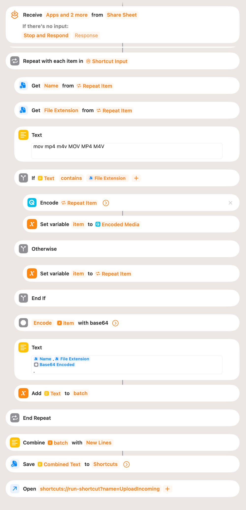
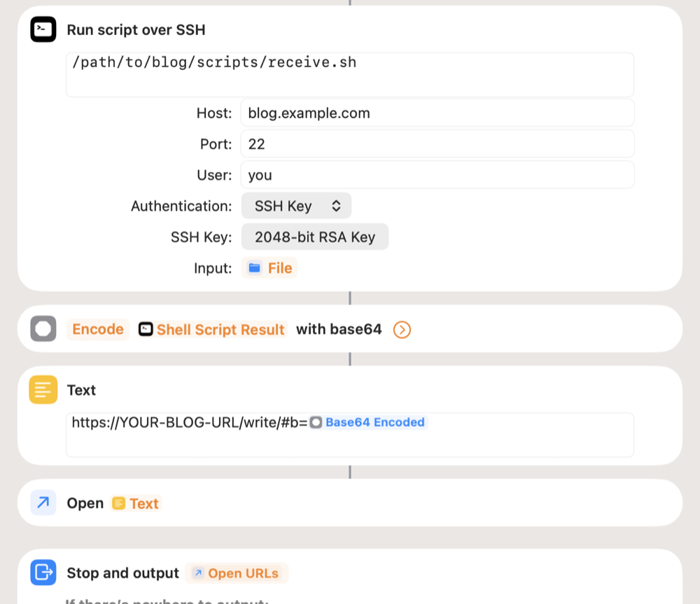

# Operating blog.sh

Day-to-day usage of an installed site: writing, deploying, cron, backup
and what to do when something fails. For the zero-to-deployed path see
[install.md](install.md).

## Writing and publishing

`./blog.sh` with no arguments opens a numbered menu; every command also
works directly (`./blog.sh add`, `edit`, `publish`, ...). The flow is
built around drafts:

1. **`add`** opens `$EDITOR` with a frontmatter template (title, tags,
   type) -- the in-editor hint links to the `/markdown/` syntax
   reference on your own site. Saving always creates a **draft**: it
   builds and deploys immediately, but only onto a hidden
   `/draft/<token>/<slug>/` address with `noindex` -- invisible in every
   listing, shareable by URL (that's the point: open the preview on a
   phone or send it to someone before publishing).
2. The CLI then asks: **publish / schedule / keep as draft / back to
   editing.** Publishing sets the date to that moment (scheduling asks
   for one instead), moves the post to its real URL and -- with a comments
   network configured (Mastodon or Bluesky, see
   [install.md](install.md#8-comments-network-optional-mastodon-or-bluesky)) --
   sends the announcement post that replies-as-comments hang off.
3. **`edit <slug>`** round-trips the stored post back to Markdown in
   your editor. A save that would drop content markdown can't express
   (an imported embed, a link card) warns and asks before proceeding.
4. **`unpublish <slug>`** returns a post to draft and deletes its
   announcement on the network (an announcement pointing at a dead URL
   helps nobody). The next publish gets a fresh date.
   **`delete <slug>`** moves the post and its media to `trash/` --
   **`restore <slug>`** brings it back. Trash keeps only the most
   recent deletion per slug.
   The same slug can exist in several years (backdating makes that
   easy); every slug-addressed command -- `edit`, `delete`, `toot`,
   `publish`, ... -- then first lists the matching posts (date, type,
   state, title) and asks which one you mean, so a delete can't
   silently land on the older post. A number picks, anything else
   cancels.
5. **`toot <slug>`** (Mastodon sites) or **`bluesky <slug>`** (Bluesky
   sites) (re-)sends the announcement for an already published post --
   typically an imported one that never had one. An existing
   announcement is never overwritten.

**A post's header can say more than the template offers.** `add` prefills
title, tags and type, because that is what every post needs; the parser
accepts a few more keys, and `edit` brings back whichever ones the post
already carries, so each can be read as well as changed:

- **`series: Name`** files the post into a series. A series with two or
  more published parts gets a listing of its own at `/series/<slug>/` --
  a series of one is just a post, and the listing appears when the
  second part does. The build puts "Part 2 of 5"
  on each post in it, with the way to the part before and the part after
  -- within the series only, since a post's chronological neighbours
  across a whole archive are rarely what a reader wants next. Parts are
  ordered by date, which is what a series written in order needs;
  **`series_part: 3`** is for the one written out of order or inserted
  afterwards. The draft preview answers the series question at writing
  time: a name with published parts shows how many and which part this
  would become, and a name no published post carries yet is called out
  as "a typo, or the first part?" -- so a misspelling doesn't quietly
  found a second series. `check` catches the older ones
  ([below](#checking-the-archive)).
- **`link:`** gives the post a link card: the address it is about, drawn
  above the text. `link_title:` and `link_description:` are the words on
  it, and a post with no `title:` of its own is named by the card. It is a
  header key rather than a line in the body because a paragraph that is
  only a link already means something else -- an ordinary link in ordinary
  prose -- and because the card belongs to the post, not to a paragraph of
  it. `edit` writes all three lines back out, so a save cannot drop a card
  the author never touched. The address is a whole `http://`/`https://`
  one, or one rooted at this site (`/posts/2026/some-post/`) for a card
  about another post here -- which is also the shape `check --repair`
  leaves behind when it straightens a relative link out of an import.
- **`publish: yes`** publishes the post the moment `add <file>` writes
  it -- the date settled, the announcement sent, the site rebuilt -- the
  road `publish <slug> --yes` takes at a desk. It is the one key only the
  file route reads; the wizard never publishes directly. Absent, or
  anything but yes/true/1, is a draft.
- **`toc: true` / `toc: false`** overrides the table of contents. A post
  with four headings or more gets one on its own -- that is the length at
  which a reader starts scrolling to look for something rather than
  reading down. Say `false` on a post that has the headings but not the
  shape, `true` to force one below the threshold.
- **`hero: true` / `hero: false`** decides whether the post's first usable
  image runs full width above the title, with the date moving into a
  byline under the picture. Without the key the post follows
  `layout.hero` for the whole site
  ([install.md](install.md#the-menu-the-regions-and-a-stylesheet-of-your-own)).
  A 1px image is never lifted, and a post with no usable picture simply
  keeps the ordinary shape -- there is no second template to keep in step.

**Two things the site says without being asked.** Every card and every
post page carries how long the post takes to read, counted at 200 words
a minute -- the same figure `./blog.sh stats` reports; a post too short
to time says "under a minute". And the build writes a `noindex`
`/404.html` in the site's own chrome, menu and search field included, so
a dead end is somewhere to go on from.

**Backdating** isn't part of that flow -- publishing means "now" -- but
the frontmatter parser still honors a `date:` line you type in by hand
(the template just doesn't offer one). To publish a draft into the
past:

```bash
./blog.sh edit muj-post      # add a line between the --- markers:  date: 2019-11-17 10:00
./blog.sh publish muj-post   # -> "Date kept from frontmatter: Nov 17, 2019 10:00"
```

The date takes any format `Time.parse` reads and is interpreted in
`site.timezone`. The post's URL year follows the date -- the JSON and
the media directory move into that year -- and the auto-announcement
asks for confirmation first when the date is more than a day off. A
backdated post is ordered by its date, so it can skip the homepage and
RSS entirely and land straight in the archive; the CLI says so when it
happens. If another post already owns that year/slug combination,
publishing refuses rather than overwrite it. (`schedule` is the
opposite direction on purpose: it refuses past dates.)

**Scheduled publishing:** in the post-save dialog, choose `[s]` and
enter the publish date and time directly -- the
[publish-scheduled cron](#cron-sidebar-widgets-and-post-stats) then
publishes the draft (toot included) once that date arrives, keeping it
as the post's date. The standalone `./blog.sh schedule <slug>` asks the
same question, so either route works. The time you type is read in
`site.timezone` ([install.md](install.md#2-configure-the-site----configsiteyml))
-- worth setting before you schedule anything from a server, whose clock
is usually UTC. A past date is refused (that would
just mean "publish now", and `publish` is for that). Running `schedule`
on an already scheduled draft cancels it; `list` shows scheduled drafts
as `[SCHEDULED]`.

Two kinds of post are published by that cron without being announced, and
it says so per post, naming `./blog.sh toot <slug>` for sending the
announcement by hand: a post dated more than a day from now (a backfill --
an old thread given a page, a post imported and then queued -- reads as
news in a live timeline), and a post that already carries an announcement
of its own, which happens when it was published once, unpublished and put
back in the queue. Announcing that one again would leave the first thread
live with its replies while the post pointed at a second, empty one.
Several posts falling due in the same tick -- after the cron has been down,
say -- are published oldest first, in the order the queue was arranged in.

### In the terminal

The CLI adapts to where it runs. In an interactive terminal you get
arrow-key menus (digits still quick-select, typing a slug still works),
single-keypress answers without Enter, colored state markers and a
**QR code of the draft preview URL** -- point your phone's camera at
the screen instead of retyping a token. A menu longer than the terminal
is tall scrolls, showing your position in the list next to the hint;
`Page Up`, `Page Down`, `Home` and `End` work in every list.

**The screens hold still.** Menus, the queue, the archive, a post's
properties and every picker repaint over themselves instead of printing
another copy on each keypress -- and not on the alternate screen, so the
last screen and your scrollback survive. Resizing straightens a waiting
menu, the queue or the properties screen on the spot; a picker or the
archive browser keeps the size it opened with until you leave it.

The three question-and-answer wizards -- `./setup.sh`, `./style.sh` and
`./import.sh` -- keep the section you are in and the answers already given
above the question, so a half-finished run says where you are.

Piped, scripted or cron runs get the plain line-based prompts unchanged,
with no escape codes in the output. Colors honor `NO_COLOR` and
`TERM=dumb`.

`./blog.sh preview [<port>]` serves the built site locally (default
port 8000) when you want to look at it without deploying.

### Properties and actions

`./blog.sh props <slug>` (in the wizard: pick a post, then `v`) shows
everything about one post in one place -- state, type, tags, the pin,
the announcement -- and offers the guarded actions:

- **published**: unpublish, (re-)announce, pin/unpin, rename the slug,
  review the old addresses that redirect here, delete;
- **draft**: publish, schedule (or reschedule, or cancel the schedule),
  rename the slug, delete;
- **either**: `[e]` opens the post's properties -- which series it is in
  and which part of it, its tags, its type, and the three flags (out of
  the listings, lead image, chapter list);
- **either, once there is one**: `[v]` restores what the post said before
  one of its recent saves.

**Properties are what the post IS, not what it says**, and until 1.7 the
only way to change one was `edit` -- the whole article open in an editor
to add a series somebody forgot. Worse, on a post whose blocks markdown
cannot all write down (an imported embed, a link card that is not the
first block) that edit asks whether it may drop them, which is a great
deal of risk for one word of metadata.

`[e]` writes each answer as it is given and rebuilds once on the way out.
Two of the rows are pickers rather than prompts, on purpose: the series
row lists the series the site already has, with how many posts carry
each, because a series typed a second time is a second series and `check`
only notices afterwards -- and the type row lists the eight the engine
knows plus the way back to letting the content decide, which is what a
post with no `type` of its own has always done. The tags row prints the
site's most-used tags above the line it asks for, for the same reason.

The lead image and the chapter list have three states, not two: on, off,
and whatever the site does -- which is what a post that says nothing
about them takes, and a different thing from saying no.

**Undoing an edit** is what `[v]` is for. Every `edit` keeps the previous
text first, up to ten of them per post, and `[v]` lists them newest first
with the line under the cursor showing what that version said -- its
title, or its opening words when it has none -- so the choice is made by
recognising the text rather than by reading timestamps. The key appears
only on a post that has been edited at least once.

Choosing one is itself undoable: the current text is kept as a version
before it is replaced, so a wrong choice is one `[v]` away from being
walked back -- which is why a single key confirms it. Only the text comes
back -- images are not versioned, and the line above the list says so. A
version that will not parse stays in the list without a preview. Versions
travel with the post into the trash and back out again.

Type and tags are shown here but *edited* in the frontmatter of `edit`,
prefilled with their current values -- one keystroke away from the text
they describe. The pin is the exception: it is a switch, not a value,
so `[c]` flips it right here (the `pinned:` header line keeps working
too). The pinned post is also marked `[PINNED]` in every list and
picker, so it can be found without remembering it. A plain draft shows
no time on purpose: a draft has none until publishing or scheduling
gives it one.

**Keeping a post out of the listings** is the `unlisted: true` line in
its frontmatter. The post keeps its ordinary address, its date and its
redirects, and drops out of the homepage, the tag and type archives, the
feeds, the sitemap and the search index; its page is `noindex`. It is
the draft's hidden address, generalised to something finished -- for a
post meant for the few people you send the link to. **It is not a
password**: a static site hands over whatever is asked for, so anyone
with the link can read it and forward it. If that is not good enough,
the answer is not to publish it. Publishing an unlisted post announces
nothing -- by hand or from cron, and `--force` does not open that door,
because an announcement cannot be recalled once a server has it; to
announce the post, take the flag off first. `props` says so on an
unlisted post, and the line comes back with its current value the next
time you edit, so the state can be read as well as changed.

**Renaming a slug** never breaks a link. The old address stays on the
site as a one-page redirect to the new one, recorded in the post itself
(`former_slugs`), so it survives edits, re-imports and full rebuilds. A
rename costs one extra page per old address -- not a 404. Two things to
know: unpublishing takes the redirects off the site along with the post
(they return when it does), and deleting the post deletes its old
addresses' redirects with it. Renaming a draft is free -- nothing is
published yet -- but its preview URL changes, so share the new link.
One consequence the redirect can't cover: feed readers identify posts by
their URL, so a renamed post may appear once more as a new item in
subscribers' readers. The redirect keeps every clicked link working;
what a reader app shows is its own business.

**Moving a post to another year** -- editing its date across a New Year
-- moves its public address the same way a rename does, and records the
old one the same way. The link from before the edit keeps working.

**Old addresses can also be given up**, with `[a]` in the same dialog:
it lists every address that redirects here and drops the one you pick.
There is one situation where that is the only cure rather than a
preference: if a NEW post has since taken an old address, the build
refuses to overwrite a live page with a redirect stub -- correctly -- and
says so on every build. The entry can never do anything again, and `[a]`
marks exactly that entry as "taken by another post". Dropping any other
one is a decision, not a repair: that link stops working for good.

The wizard menu lists six activities -- a new post, a post in hand, the
scheduled-post queue, the archive browser, the trash and a rebuild --
not every command: publish, schedule, unpublish, delete and the
announcement live in this dialog (and the draft dialog) instead of
being menu items. Every CLI command still exists unchanged --
`./blog.sh unpublish <slug>` works exactly as before; only the menu
stopped listing it.

## Writing from a phone

The trick is that a bare filename in an image line resolves against the
`incoming/` staging directory:

1. Shoot a photo, upload it via any SFTP client into `<repo>/incoming/`
   (setup: [install.md](install.md#7-running-on-a-server)).
2. SSH into the server, `./blog.sh add`, and write
   `` -- no path.
3. If the photo hasn't finished uploading yet, the CLI waits and
   re-checks on Enter instead of failing.
4. On save the photo is copied into `media.nosync/<year>/<slug>/` and
   its `incoming/` copy is removed -- an empty `incoming/` means nothing
   is pending.
5. Editing that post later doesn't need the photo again: a bare filename
   is looked for in the post's own `media.nosync/<year>/<slug>/` first and
   in `incoming/` only after that, so a file that's already been saved
   resolves without any upload (and without being copied again).

iPhones photograph in HEIC by default, which only Safari can display.
Attaching one stops the save with the exact conversion command -- or, with
`media.convert_heic: true` in `config/site.yml`, the engine converts it to
JPEG itself during the save (detected by content, so a HEIC named `.jpg`
is caught too; AVIF, which browsers do display, is left alone). The
simplest fix is on the phone itself: Settings → Camera → Formats →
Most Compatible.

**A photo's GPS position never reaches the site.** Saving strips the
place of capture from the file's metadata (`media.strip_location`, on
unless `config/site.yml` turns it off -- the notes there say why); the
camera, the moment and the orientation stay. `./blog.sh doctor
--strip-location` cleans photos saved before the engine did this -- the
only thing doctor ever writes.

**Video from the same phone is mentioned, not refused.** The same
setting decides the codec, and the save says one line when it matters:
that a clip is HEVC (most browsers play it, the rest show an empty
player), or that it is a QuickTime `.mov` (the video inside is usually
ordinary H.264, but not every browser accepts the container). Both come
with the `ffmpeg` command that fixes them -- re-encoding for the codec,
repacking for the container, which copies the video across untouched.
A third line is about neither: a video whose index sits at the end of the
file, which is where a recorder has to put it, and which makes a reader
wait for the whole download before the first frame appears. The same
repack moves it to the front.

`media: remux_video: true` has the engine do that repack itself, when
`ffmpeg` is on the machine -- index to the front, `.mov` to `.mp4`, the
picture and the sound copied across untouched, about a second for a phone
video. It is off by default, like the HEIC conversion, because it shells
out to a tool the engine does not ship. Unlike the HEIC conversion it
never refuses: no `ffmpeg`, or a repack that will not go through, and the
post is saved with the file as it arrived and the sentence the author
would have had anyway. A video in the wrong wrapper still plays for
nearly everybody; a HEIC photo does not.

The post is saved either way; the only hard stop for a video is the
per-file size limit, and a long 4K clip reaches that on its own -- a
phone clip out of the share sheet runs about 1.3 MB a second, so the
24 MB default is roughly seventeen seconds of it. A longer one wants a
smaller size chosen in the shortcut's own Encode Media step.

### Handing over a whole file

Every step above is a conversation: the CLI opens an editor, waits for a
photo, asks what to do with the draft. `./blog.sh add <file>` is the same
work with the conversation removed -- it takes a markdown file with the
usual header, writes the draft, and returns. It never asks anything, so
it is the route for a shortcut, a script or anything else running where
nobody is at the keyboard.

```bash
./blog.sh add clanek.md
```

A bare name -- one with no slash in it -- is looked for in `incoming/`,
so the file can arrive by the same upload as the photos. Anything else is
a path and is used as given, relative to wherever you were standing. A
file that came out of `incoming/` is deleted once the post is written --
the photos already work that way, and an empty `incoming/` is what says
nothing is pending. **A file outside `incoming/` is never touched**: on a
Mac that is quite possibly the only copy. The rule is about where the
file *is*, not how you named it, so `./blog.sh add "$PWD/incoming/x.md"`
tidies up after itself like any other upload.

Where the wizard would ask, this refuses instead, and writes nothing:

- a photo that has not finished uploading -- the wizard waits and
  re-checks on Enter; here there is nobody to wait for, so the missing
  names are printed and the post is not written. Upload them and run it
  again.
- an empty body, a file that is not text, a file this account cannot
  read, something that is not a file at all, an option the command does
  not have, or a second filename (one file, one post -- a name silently
  dropped is a post a looping script thinks it made).

It stops at the draft. The file says *write this down*, not *put it in
front of the world* -- publishing stays a second command:

```bash
./blog.sh publish <slug> --yes
```

`--yes` answers the draft dialog with "publish" in advance. `--json`,
which needs `--yes` beside it, prints the same object `add --json` does --
`slug`, `path`, `state`, `url`, `deploy`, `warnings` -- or a refusal with
its reason as a code (`not_found`, `already_published`, `publish_refused`),
and leaves with **zero** either way, for the reason `add` does: a phone
throws away the output of a command that failed.
`--no-announce` publishes the page and sends nothing to Mastodon or
Bluesky; it works with or without `--yes`, and because nothing was
attempted, `./blog.sh toot <slug>` can still send the announcement by
hand afterwards. (It does not travel into a *scheduled* publish -- the
cron works from the post itself and will announce it when its date
arrives; the run says so if you schedule under the flag.)

One question `--yes` will not answer for you: a post dated outside the
recent window is published but **not** announced, and the run says so.
Announcing is the one step that cannot be taken back. Two more it
refuses rather than guesses: `--yes` needs the slug spelled out (without
one, `publish` offers the drafts to pick from, and picking belongs with
the preview in front of you), and it will not choose between two posts
sharing a slug in different years -- it names the years and stops.

`--json` turns the answer into data -- one object on standard output and
nothing else, so a caller can read it without parsing prose:

```json
{
  "slug": "psano-v-posteli",
  "path": "content.nosync/posts/2026/psano-v-posteli.json",
  "state": "draft",
  "url": "https://example.com/draft/89260b63fb498e75/psano-v-posteli/",
  "deploy": "done",
  "warnings": []
}
```

Every key is always there. `deploy` is `done` when the site is already
carrying the draft and `pending` when it owes an upload that the next
scheduled run will finish -- the difference between "open this address
now" and "open it shortly". `warnings` collects everything the run said
for itself, which on this route is the only place to hear it: a photo
over the size limit, a video whose container some browsers refuse, a
HEIC that was converted. `url` is empty rather than half an address when
the site has no `base_url` yet, and the reason is in `warnings`. The
exit code is 0 or 1, nothing else. A refusal answers in the same place
and leaves with zero too, as a different object -- `ok`, `error`,
`message` -- because the status answers a question the object cannot:
whether an answer arrived at all. Only a flag the command does not have
and a second filename fall outside this, and those end in prose on
standard error.

### A post sent from the phone itself

`write: true` publishes a page at `/write/` to write the post on: a title,
the text, tags, and photographs each with its description. It keeps what
is typed in the browser, so closing the tab in a tunnel loses nothing --
the text in localStorage, the bytes of the pictures and videos in
IndexedDB, which holds hundreds of megabytes where localStorage holds
five. The
page is marked `noindex` and holds no secret of its own -- what sending
needs is the key, and that lives in the shortcut on the phone. Add it to
the home screen and it opens as an app -- that is what the manifest among
the published files is for.

It also carries a content policy of its own, which is the one thing it
could not inherit: the page is copied onto the site as a file and never
goes through the layout every other page is rendered by, so until 1.7 it
had none. Now it does, and it is a short list -- scripts and styles from
the blog, pictures and video only as the page's own `data:` and `blob:`
bytes, one place to connect to (itself, for the receipt), the preview
frame same-origin, no form action at all, and scripts never inline. A
reply arriving in the address bar has nowhere to reach even if it
carried something that ran.

The page is the same file on every site; what is this site's the build
writes beside it as `write/site.js`: the short name and claim for the
header, the palette from `colors:` so the page is dressed like the blog,
the favicon, and every tag the blog has used, with its count of all time
and of the last twelve months. The tags are offered as they are typed:
with nothing typed yet, what the blog has tagged in the last year, most
used first -- not the most used of all time, which on an imported
archive are the places it came from; then whatever begins with or
contains the letters so far, searched across every tag. So a tag is
tapped rather than typed, and typed as it was before instead of the blog
growing a second spelling of it.

The page speaks the blog's language, `site.lang`, whatever the phone is
set to; the browser's is used only where there is no `site.js`, or where
the blog's language is one the page has not been translated into. Above
the text sits a row of marks -- bold, italic, strikethrough, code, link,
heading, quote, list, numbered list, code block. A paired mark wraps
what is selected, and a second tap takes it off; with nothing selected
it puts the pair in and leaves the caret between. A line mark goes to
the start of every line the selection touches, and comes off the same
way. The link mark reads the selection, widened to whole words: an
address -- `https://…`, or a bare domain, which gets its `https://` --
becomes a link with the words left to type; words become one with the
address left to type.

A picture does not travel as it is. The page draws it through a canvas
first -- 2560 px on its long edge, JPEG at quality 0.88 -- which is what
makes a post of four photographs fit under the ceiling at all, and it is
why the file arrives as `vlak-v-chocni.jpg` whatever the phone called it:
the name is folded to ASCII so the markdown can name it without escaping,
and a second picture folding to the same name gets `-2`. A picture this
browser cannot decode -- a HEIC outside Safari -- is passed through
untouched under its own extension. Send the original by SFTP and use
`add` if the re-encode is not what you want.

A video goes the same way as a picture -- the same button, the same
card, the same description -- and into the text as `!![description]
(clip.mp4)`, two marks where a picture has one. Nothing on the page
shrinks it: it travels as it is, and the blog says on arrival what it
says of any phone video (see below). What limits it is the receiver's
ceiling on one delivery, `BLOGSH_MAX_MB` (24): the page carries that
number in `site.js`, says under the pictures what happens to a picture,
what to a video and how much the server takes, and turns the batch line
red the moment the post outgrows it -- before the phone spends the
upload finding out. The first tap on Send stops there and says it; a
second tap sends anyway, because the page's number is the build's and
the server's may have been raised since. The receiver reads the variable in its own
environment, the forced command's, and the build reads it in the
build's; raise it in both places or in neither.

*Preview*, under the text, shows the post as the blog would show it --
in the blog's own stylesheets, which `site.js` names, with the pictures
in their places. Near enough, not exact: the engine renders the real
thing, and the draft's preview after sending is that. What it is for is
seeing the shape of a post before it leaves the phone.

Pressing send hands the files to iOS: **one for each picture, and one for
the text**. Nothing is packed for the server: it takes files, not
archives. A browser that refuses to hand files over at all gets the post
saved as one archive instead -- a net, so a post written on the way home
is not lost to a browser that will not share it, rather than a road this
page offers. `/write/` is for a phone; on a phone the files go over.

**Two shortcuts, because the one that receives the files may not open an
SSH connection.** A shortcut started from the Share Sheet runs in
Shortcuts' background runner, whose only screen is a banner; *Run Script
over SSH* asks for a screen there -- the host prompt, the first-run
privacy question -- and is refused with "This action could not be run
with the current user interface", before any connection is made. The
action that would hand the run over to the full app, *Continue in
Shortcuts App*, is no longer offered. A shortcut started from a URL,
on the other hand, always runs in the app. So the receiving shortcut
writes a file and opens a URL, and the sending shortcut does the rest.

*Shortcut A* -- "Show in Share Sheet" on, accepting Images and Files;
"If there's no input": Stop and Respond:

1. **Repeat with Each** over Shortcut Input, and inside it: Get **Name**,
   Get **File Extension**, then a **Text** holding `mov mp4 m4v MOV MP4
   M4V` and an **If** *Text contains File Extension*. Inside the If:
   **Encode Media** the Repeat Item with Size **1280x720**, and **Set
   Variable** `item` to *Encoded Media*; in Otherwise: **Set Variable**
   `item` to *Repeat Item*. After End If: **Base64 Encode** `item`, a
   **Text** of three lines -- `Name.File Extension`, `Base64 Encoded`,
   `.` -- and **Add to Variable** `batch`.

   The If is what makes a video from the phone fit: a clip from an
   iPhone, 32.5 MB of HEVC, came out of Encode Media at 5 MB of H.264, in the
   QuickTime container it arrived in, so the extension the batch names
   is still right. A picture takes the Otherwise branch untouched. The
   page cannot know the shortcut does this, so its red line for a video
   measures the original; send anyway, and the answer says what
   arrived.
2. After the loop: **Combine Text** `batch` with New Lines.
3. **Save File** the combined text to iCloud Drive, into the Shortcuts
   folder, *Ask Where to Save* off, subpath `incoming/batch.txt`,
   *Overwrite If File Exists* on -- the same folder shortcut B reads it
   back from.
4. **Open URLs**: `shortcuts://run-shortcut?name=UploadIncoming`.



*Shortcut B*, named exactly `UploadIncoming`, not in the Share Sheet:

1. **Get File** `incoming/batch.txt` from the Shortcuts folder, without
   the document picker.
2. **Run Script over SSH** with that file as the **Input**; the script is
   the receiver, or the wrapper that reaches it.
3. **Base64 Encode** the *Shell Script Result* (Line Breaks: None, if
   the option is offered; the page copes either way).
4. **Text**: `https://YOUR-BLOG-URL/write/#b=` followed by the *Base64
   Encoded* variable, with nothing between them.
5. **Open URLs** with that text.



Both can be imported instead of built: [blog.sh Send post](shortcuts/blog.sh-send-post.shortcut)
is shortcut A and [UploadIncoming template](shortcuts/UploadIncoming-template.shortcut)
is shortcut B, signed so that anyone may import them. After importing,
rename the second to exactly `UploadIncoming` -- the first opens it by
that name -- and fill in what is yours. In *Run Script over SSH*: the
machine you log into (a host name or an IP address), its SSH port, the
user, and the path to `scripts/receive.sh` or the wrapper that reaches
it. In the *Text*: `YOUR-BLOG-URL` is the address the site is served at,
`base_url` in `config/site.yml`. The SSH action carries no key; pick or
generate one there and put its public half on the server, as the key
line below shows. The first shortcut needs nothing changed.

Base64, not URL Encode, and not for taste: Shortcuts reads a reply
that is JSON as a Dictionary and then refuses to hand a Dictionary to
URL Encode -- "couldn't convert from Dictionary to Text" -- on exactly
the replies that matter, the refusals. Base64 Encode takes anything.
(The page also still reads a percent-encoded reply after `#r=`.)

The last three carry the answer back to the page. It opens with the
reply after `#b=` -- a fragment, so it never leaves the browser -- and
says what the server did: the pictures it kept, the draft's preview
address or the post's public one, the command that publishes a draft
from a keyboard, and a refusal in the reader's language where the page
knows the code, in the server's own words where it does not. A post the
server took is cleared from the device; a refusal keeps everything, so
it can be mended and sent again.

**And the page asks, as well as waiting.** That road back has one break
in it that nothing on this end can mend: a page kept on a phone's home
screen runs with storage of its own, so a reply that arrives as a URL
opens in the browser, where the draft it is about does not exist -- and
the draft stays on the home-screen copy, looking unsent. So the page
picks a name for its answer before it sends anything (`receipt:`, sixteen
hexadecimal characters, written into the markdown), and the build leaves
a small JSON file at `/write/r/<receipt>.json` saying the slug, the
state, the title, the address, and whatever the save had to complain
about -- a picture whose size could not be read, a video that will make
the reader wait, a player that was not found. The page draws those the
way it draws the answer that comes back through the address bar, because
the phone is the one place with no terminal to read them in. Only what
was said about the POST: the file is served to anyone who has the
sixteen characters, so what the run says about the SITE afterwards (a
missing `base_url`, whatever the rebuild warns about) stays out of it.
The page asks for it every three seconds for five minutes, and says so
if it never comes. Whichever answer arrives first is the one that is
shown.

The file is written by the BUILD, which is what keeps it true: publish
the post and the next build says published and gives the public address;
delete the post and nothing generates the file, so the sweep takes it
away. It exists only on a site that serves the page, and only for a post
that asked for one.

**Publishing from the phone.** The answer for a draft carries a Publish
button, and it sends one file called `publish.txt` holding the slug --
down the same connection, through the same two shortcuts. The receiver
knows that shape: exactly one file, called that, and it runs
`publish <slug> --yes --json` rather than storing anything. The slug is
checked as hard as a filename is, because it becomes an argument to a
command: a leading dash is a flag, and anything outside a slug's own
alphabet is refused here rather than explained by whatever it hits. The
page then asks the same receipt again until it says published.

One connection carries the post however many photographs are in it, which
is the point: connections are the scarce thing, not bytes. The first run
in the app asks whether the shortcut may send its items to the host --
answer Always Allow; that is the very question the background runner
could not put on screen.

The page that sent the files sees the share end in an abort -- that is
how the hand-off to the app looks from a web page, not a failure -- so it
says the files have left. The answer arrives when shortcut B opens the
page again with it.

The order inside the batch matters, because the markdown arriving is what
makes the post and everything its text names has to be on the server by
then. The app puts the markdown last for exactly this reason. Get it wrong
and nothing breaks -- the engine answers `missing_images` and writes
nothing, and sending the text again once the pictures are up is all it
takes.

**Draft or public is decided when the post is sent.** The page has a
switch, Draft or Publish now; Draft is the default and writes nothing.
Publish now writes `publish: yes` into the front matter, and `add` then
takes the road `publish <slug> --yes` takes at a desk: the date is
settled, the announcement goes out to the networks the site has
configured, the site is rebuilt and deployed, and the answer carries the
public address rather than a draft one. There is no third state: a post
that is public is announced, on a phone as at a desk. The key is only
read by `add <file>`; the wizard never publishes directly.

`add <file>` wants the file to be on the server already. `receive.sh` is
how it gets there: **the whole post down one connection**. Each file is a
name on its own line, its base64 after it, and a line holding a single `.`
to say that was all of it -- then the next name.

```bash
{ for f in photo.jpg post.md; do
    printf '%s\n' "$f"; base64 < "$f"; printf '.\n'
  done
} | ssh blog ./scripts/receive.sh
```

**One connection, not one per file.** It was one per file once, which is
simpler and does not work: a server worth running drops new SSH
connections that arrive in a rush, and a common setting allows about four
a minute. A post with three photographs sat exactly on that line and one
with nine had no chance -- the sender saw "could not connect to the SSH
server" and the pictures that never arrived were missed by nobody, since
each connection answered for itself alone.

Every name in the delivery is read before a single byte is written, so a
batch refused on its fifth name leaves nothing behind from the first four.

**The closing dot is not decoration.** A connection that drops halfway
ends the same way a finished one does -- the receiver reads to the end
of the stream either way -- so half a photograph arrived, decoded into
half a picture, and was answered with `ok`. Without the dot the transfer
is refused as `truncated` and nothing is stored.

A shortcut on a phone sends a whole post that way -- every picture, then
the markdown, down one connection -- and **the markdown last**, because
the markdown arriving is what makes the post. Everything its text names
is already staged under the name it
uses, so there is no other signal to send and none is needed. The answer
to a picture is `{"ok":true,"stored":"photo.jpg"}`; the answer to the
markdown is the same JSON `add --json` gives.

⚠️ **The shortcut has to SHOW the answer, or every refusal looks like it
worked.** A refusal leaves with zero -- deliberately, because iOS Shortcuts
discards the output of a remote command that failed, and the reason is the
whole point of the answer. The cost is that Shortcuts then reports a tick
for a refusal exactly as it does for a post. End the shortcut by opening the
page with the answer, as shortcut B above does, or with a *Show Content*
of the SSH output. The reply is one JSON object per file, so read it
whole: a picture answers `"ok":true`, a refusal answers `"ok":false` and
names the reason, and the post that was written answers with a `slug`
and no `ok` at all. Without that, a shortcut whose Input field is empty connects,
waits out the thirty-second deadline, is refused for `empty_input`, and
shows a tick -- which is a slow, silent way to learn nothing.

**The exit code answers a different question from the JSON.** Zero means
an answer arrived -- read the object, which says `"ok"` and, when that is
false, names the reason. Non-zero means there is no object to read at
all: the script was killed, or the shell never got to run it. Everything
the receiver can put into words leaves with zero, and that includes the
refusals about the installation rather than the delivery -- no
`incoming/`, no engine, a ceiling that is not a number. Which kind of
trouble it is, the error code says. (iOS Shortcuts discards the output of
a remote command that failed, so a refusal that exited non-zero reached a
phone as a bare status with its reason gone -- exactly when the reason
was the point, and those refusals are the ones a new install meets on its
very first delivery.)

The body has a deadline of its own, `BLOGSH_BODY_SECONDS` (600): a delivery
that has not finished by then is dropped and, if the sender is still
listening, told `timeout`; it is set where `BLOGSH_MAX_MB` is, below.
Two files under one name in one delivery are
refused (`bad_name`) rather than one silently replacing the other, every
body is decoded before any file is written, so a refusal on the third
picture leaves nothing of the first two behind, and a blank line after a
complete delivery is not held against it. When the engine itself does
not answer in JSON -- no `env.sh`, no ruby, a configuration that will not
parse -- the receiver answers for it with `engine_failed` and the words
the engine printed, and every delivery ends with status 0 once an answer
has been given -- a ceiling that is not a number (`bad_limit`) included.

A delivery that goes wrong halfway can simply be repeated. Pictures wait
in `incoming/` until a text names them, so a refused post leaves them
where they are and sending it again finds them -- nothing has to be
uploaded twice.

**Nothing new listens on the network.** It travels over the SSH the
server already has, and the key it travels on wants a forced command:

    restrict,command="/path/to/blog/scripts/receive.sh" ssh-rsa AAAA... phone

The key has to be RSA. Shortcuts' *Run Script over SSH* does not speak
ed25519 and says nothing when it meets one -- the run simply fails.

**What a stranger chooses is a filename and some bytes**, so that is what
is checked. A name carrying a path or a backslash, beginning with a dot,
empty, longer than a filesystem will take, or holding a control
character is refused (`bad_name`) and nothing is written. What arrives
is bounded before it lands rather than weighed afterwards:
`BLOGSH_MAX_MB` (24) is a ceiling on reading, so a sender costs that
much and not whatever they felt like sending. The number is measured on
the encoded stream, not on the files -- base64 is a third larger -- so a
24 MB ceiling takes about eighteen megabytes of photographs; the page's
legend says the same, and the red line it draws counts the encoded
size. A delivery that overshoots
is read to its end into nothing -- up to four times the ceiling -- and
then refused, so the sender finishes and hears `too_large`; refused the
moment the ceiling was reached, a phone with megabytes still to send sat
on "running" with no timeout to save it, and the answer never arrived.
Beyond that bound the channel closes, and a hostile sender costs
reading, never storage. And the post
itself is handed to the engine as **untrusted**, so a picture may be
named only by a bare filename -- `` is refused
(`bad_reference`), because otherwise it would read that file into the
post and publish it.

**Raising the ceiling is two settings, not one.** The receiver reads
`BLOGSH_MAX_MB` from its own environment -- the one the forced command
runs in: put it in the key's line, `command="BLOGSH_MAX_MB=64
/path/to/blog/scripts/receive.sh"`, or, where the command is a wrapper
that enters a container, in that wrapper (`docker exec -e
BLOGSH_MAX_MB=64 …`). The page at `/write/` never asks the server; it
shows the number the BUILD saw in `BLOGSH_MAX_MB` when it wrote
`site.js` -- so set the same value where the build runs (`env.sh`) and
rebuild, or the page will warn at 24 while the server takes 64, or say
nothing while the server refuses. Unset on both sides, both say 24.

There is deliberately no archive. An earlier design took a ZIP and
unpacked it here; three adversarial audits found blocking faults in three
successive rewrites of it, and nearly all of them lived in the unpacking
-- entries that were symlinks, names that collapsed onto each other, a
bomb that wrote gigabytes from megabytes, a half-failed extraction that
published a truncated photograph and reported success. None of that can
be expressed when there is nothing to unpack.

## Pinning a post to the front page

The `[c]` action in `./blog.sh props <slug>` pins a published post --
or unpins it again; `pinned: true` in the post's header
(`./blog.sh edit <slug>`) does the same thing the long way round. A
pinned post is held at the top of the front page, marked with a pin in
the corner of its date badge. It appears there once: while it is still on the front
page anyway it is lifted to the top rather than shown twice, and once it
has aged onto `/page/2/` the front page keeps the copy at the top while
page 2 lists it in its normal place, unmarked.

Only the front page. Type and tag listings, the RSS feed, the sitemap
and the search index stay strictly chronological -- a pin is a statement
about the front page, not about the archive. Toggling it is a small
deploy, because pagination is anchored and the front page is the only
flexible one. Pin a second post and the newest of them wins, with a
warning in the build output.

## Publishing slots

Set the times posts usually go out and `[s]` stops asking for a date:

```yaml
publishing:
  slots:
    - "mon 09:30"
    - "wed 09:30"
    - "fri 09:30"
    # or a single "daily 09:00"
```

The draft dialog then names the next FREE slot in the `[s]` choice
itself, and the prompt offers it: Enter accepts, typing a date overrides
it, the cancel word backs out. Free means no other scheduled post is
aimed at that exact time, so three drafts written in one evening queue
onto three consecutive slots instead of publishing together, and the
confirmation says which post goes out before this one.

The offer also names the earlier slots it had to walk past and the post
sitting in each, so a queue that seems to skip a day explains itself.
The properties dialog of a scheduled draft prints the whole queue for
the same reason, with an arrow on the post you are looking at.

Slots only ever suggest. A post scheduled by hand for 14:17 occupies no
slot and blocks nobody, nothing moves a post that already has a time,
and without the key in `config/site.yml` the prompt is the plain one it
always was. Times follow `site.timezone`, daylight saving included --
"mon 09:30" is 09:30 on the wall clock on both sides of the change. The
[publish-scheduled cron](#cron-sidebar-widgets-and-post-stats) still runs
on its interval, so a slot publishes within one tick of its time.

### Working the queue

`./blog.sh queue` (also a wizard menu entry) shows every scheduled post
in publish order and acts on the one you pick:

- `[u]` / `[d]` move it a slot earlier or later. Moving exchanges times
  with the neighbouring post -- the set of occupied times never changes,
  only which post sits in which. A hand-scheduled 14:17 stays a 14:17.
  The cursor follows the post you moved, so pressing `[u]` again carries
  the same post further.
- `[m]` picks the post up and carries it: the arrows then move the post
  itself through the queue, Enter puts it down and Escape leaves the queue
  as it was. Carrying from the eighth slot to the second steps the six in
  between back one slot each, so the same times stay occupied and the
  whole move is one write instead of one per slot. For a single slot
  `[u]`/`[d]` are quicker; `[m]` is for the longer trip, and it is offered
  in a terminal only -- a piped run has `[u]`/`[d]` and no screen to carry
  anything across.
- `[p]` publishes it right now, the same flow as publishing a draft by
  hand (announcement included).
- `[s]` asks for a different time, same prompt as scheduling.
- `[n]` returns it to the drafts; the post keeps its text, loses only
  the plan.

When a post leaves the queue -- published now, or removed -- its time is
free again, and the screen offers to let the posts behind it each step
forward into the gap, every one taking over its predecessor's time. It
only offers: a hand-picked date further down may be deliberate, and
nothing moves a post's time except you. A post whose time already passed
is waiting for the cron and can't be reordered.

If the publishing cron happens to be running at the moment you move
something, the move is refused rather than written: the two would be
writing the same files, and the cron holds them for a few seconds at a
time. Press the key again in a moment.

The preview rebuilds once, when you leave the screen, not after every
move.

## Attachments and the document type

A line that is nothing but `[label](handbook.pdf)` -- a bare filename,
whitelisted extension -- makes the file part of the post: it is picked
up from `incoming/` exactly like a photo, stored in
`media.nosync/<year>/<slug>/`, and rendered as a download card showing
the label, the extension and the file's size. A link to an address stays
a link; the engine can only publish files it was handed.

Whitelisted: `.pdf .zip .tgz .epub .txt .md .ics .gpx .csv` (`.tar.gz`
is not, because only the last suffix survives the rename -- use `.tgz`).
A post whose text is a short line plus attachments is filed under
DOCUMENTS, which appears in the nav once the first such post exists; a
longer article that attaches its data stays an article with a file on it.

## Importing from another platform

`./import.sh` opens its own wizard: pick a source, and it reads the whole
thing in dry-run first and tells you what *would* be written -- how many
posts and media files, the first few slugs, and how many items it skipped
and why. Nothing is written until you confirm, and confirming means typing the
number of posts rather than pressing a key -- an answer you can't give
without having read the preview. The sources cover blog and newsletter
platforms (WordPress, Blogger, Ghost, Medium, Substack, a Jekyll/Hugo
tree, ...), the social networks (Twitter/X, Mastodon, Bluesky, Instagram,
...), podcast feeds, and the Wayback Machine for a blog whose platform no
longer exists at all. The wizard groups them by that question -- a blog
you published, a network you posted to, a dead site -- and the full list
lives in [importing.md](importing.md).

Every source also runs without the wizard, for cron or a scripted
migration -- one `scripts/migrate_<source>.rb` each, e.g.
`scripts/migrate_bluesky.rb <handle>`, `scripts/migrate_instagram.rb <export-dir>`,
`scripts/migrate_wayback.rb <https://dead-blog.example>`,
`scripts/migrate_feed.rb <export.xml | feed-url>`.
Those skip the preview and write immediately; see
[the README](../README.md#importing-existing-content).

Two things to expect on a real archive:

- **It is slow, and it says so.** Media is downloaded per post, so a few
  thousand posts run for hours. Every phase reports progress -- what it's
  reading, how many items it found, then a `12/847` counter -- so a quiet
  terminal means something is wrong, not that it's working. Sample before
  committing to that: every script takes `LIMIT=20` to import only the
  first twenty, which is enough to see whether the mapping does what you
  expect. A second full run then overwrites them in place.
- **The deploy guard will stop you afterwards**, because a bulk import is
  exactly the "file count swung wildly" shape it watches for. That's
  working as intended: check the numbers, then re-run with `--force`.
- **The summary names what HTML could not become blocks.** Every adapter
  that parses HTML bodies counts the elements it had to drop -- embeds
  and forms, usually -- and the summary lists them by name and count, so
  a silent summary means nothing was lost, not that nobody counted.

Per-source walkthroughs -- where to get each export, what is kept and
skipped, undo, troubleshooting -- live in [importing.md](importing.md).

Re-running an import is safe -- posts are matched on their source
identity and overwritten in place, never duplicated
([importing.md](importing.md#what-every-import-does)); the same identity
is the safe selector when [undoing an
import](importing.md#undoing-an-import).

Back up `content.nosync/` before the first real import
(`tar czf ../content-backup-$(date +%F).tar.gz content.nosync`) -- it isn't
in git, and on a server there's nothing else to fall back on.

## Taking your content elsewhere

```bash
./blog.sh export ~/my-blog-export        # everything, drafts included
./blog.sh export ~/public-copy --no-drafts
./blog.sh export ~/somewhere --dry-run   # counts, writes nothing
```

Writes the archive as a tree of markdown files with YAML front matter,
in Jekyll's layout: `_posts/2026-05-01-slug.md`, `_drafts/slug.md`,
pages at the root, media copied under `assets/<year>/<slug>/`. Without a
directory it writes to `tmp/export`. A directory that already has
something in it is refused until you repeat the command with `--force`,
which writes alongside what is there -- an export never deletes
anything, at either end.

It reads only the archive on disk -- deliberately, so it works on an
installation whose `env.sh` is gone or whose config no longer parses.

Three things are worth knowing before you rely on the result:

- **The summary counts what could not stay markdown.** Video, audio and
  link cards are written as HTML -- video and audio deliberately, because
  the engine's own `!` reads as an exclamation mark and an
  image to everybody else's markdown parser. Every engine that passes
  HTML through renders them properly, and importing the tree back gives
  them again as blocks -- each carries its own definition in a comment
  above it, which other engines ignore.
- **`redirect_from` is written in the shape `jekyll-redirect-from`
  reads,** and it merges both kinds of old address -- where the post
  lived on the platform it came from, and where it lived here before a
  rename. On a Jekyll site with that plugin, every address the post has
  ever had goes on answering.
- **An export can be imported back.** `./import.sh` → *Markdown tree*
  reads the `blogsh:` block the export writes, so posts keep their
  identity (`source`), their series, their redirects and their
  announcement URLs. That is the supported way to move an installation
  to another machine or another host -- and, run against a scratch
  copy, the way to check that an export really did come out whole.

## Reading the archive

Two pages the build writes for you, both from the posts themselves --
there is nothing to configure and nothing to keep up to date.

**`/archive/`** is a map of the site in two levels. The first is a row per
year with a strip of twelve months, each month shaded by how much was
written in it; the second, `/archive/<year>/`, is one line per post,
grouped by month, oldest first. No excerpts and no pictures: this is an
index, and its whole point is that twenty years fit on one screen.
Pagination cannot do that -- it is anchored to the oldest post, so
`/page/128/` says nothing about whether it holds 2009 or 2014. Every
post's date badge links into the month it belongs to, so a reader who
finds one post can see what surrounded it.

A year nobody wrote in gets a row on the map and no page of its own: an
empty page is an invitation to a dead end. A post is filed under the year
of its ADDRESS, so `/archive/2025/` and `/posts/2025/` always agree.

**`/tag/`** is every tag the site has, as pills, with a superscript count
of how often each was used. It is built alphabetically -- folded, so an
accented name sorts where a reader expects rather than after z -- and a
reader can switch it to by-count, which is remembered for next time. Only
tags that have a page of their own appear, so the list never points at an
address the build did not write.

Neither page needs a menu item to work, but `nav:` in `site.yml` is where
you would put one; see **Configuration** in the README.

## Giving a tag its own icon

A tag can carry an icon, and it shows up in two places: the heading of its
`/tag/<name>/` listing, and the date badge of every post that has the tag,
where it **replaces** the content-type icon rather than joining it.

```yaml
tag_icons:
  - tag: "fotografie"
    icon: "image"
  - tag: "kolo"
    icon_svg: '<svg viewBox="0 0 24 24" ...>...</svg>'
```

A tag is matched here by its **address** -- the `/tag/<name>/` its listing
lives at -- so how the name is spelled, here or in a post, makes no
difference: `sci-fi`, `Sci Fi` and `sci_fi` are one tag, share one page and
wear one icon. A tag that leaves nothing to be addressed by, an emoji or a
piece of punctuation, has no page and takes no icon either.

The order is the priority. Most posts carry more than one tag -- 68% of
them on the archive this engine was built around -- and the tag a post was
given FIRST is usually the one an importer added, not a subject: `twitter`
opens 1256 posts there. So the first entry in this list that a post has is
the one it wears, and the site owner decides once instead of post by post.

`icon` names one the engine ships. Eight of them are the content types
themselves -- text, quote, chat, image, video, audio, link, document --
and the rest are the things blogs are about:

| | |
|---|---|
| getting about | `bike` `car` `train` `plane` `boat` `walk` |
| places and weather | `map` `pin` `mountain` `tree` `sun` `cloud` `rain` `snow` |
| a day | `coffee` `beer` `food` `wine` `clock` `calendar` `home` `heart` `star` `gift` |
| making things | `pen` `brush` `camera` `film` `mic` `music` `book` `tools` `hammer` |
| machines | `laptop` `phone` `code` `terminal` `server` `bug` `lock` `key` |
| living things | `paw` `bird` `leaf` `flower` |
| ideas | `bulb` `flag` `globe` `eye` `chart` `target` `rocket` `mail` `briefcase` `box` |

They are line drawings on the same grid as the eight, so a badge wearing
one looks like a badge. `doctor` prints the whole list when a name is not
among them, which is usually a synonym away -- `bicycle` for `bike`. A
footer link in `social:` can wear one too, where the network marks have
nothing to offer: `icon: globe` for somebody's other site.

`icon_svg` is your own drawing, on the same
24-unit grid (`viewBox="0 0 24 24"`) and stroked in `currentColor` so it
follows the light and dark themes. It does not have to be drawn from
scratch: open an icon from any set that works on that grid -- Lucide,
Feather and Tabler all do -- copy the `<path>` elements out of its file
and paste them between `<svg viewBox="0 0 24 24" width="20" height="20"
fill="none" stroke="currentColor" stroke-width="2">` and `</svg>`. Mind
the licence of whatever you take, and if the set fills its shapes rather
than stroking them, drop the `fill="none"` and take `stroke` out. Scripts, styles and event handlers are
stripped out of it before it reaches a page -- the same treatment an
imported embed gets, and for the same reason. `doctor` says when an icon
name is one the engine does not have, when an `icon_svg` holds no `<svg>`,
and when it is drawn to another scale. An `icon_svg` that is not a
drawing at all -- a filename, an address, an emoji -- is refused rather
than printed where the glyph goes, and the tag falls back to what it
would have had with no entry here.

A tag with no entry here changes nothing: its listing keeps the generic
tag icon and its posts keep the icon of their content type.

## Emptying the trash and the versions

The engine keeps two things after you are done with them, and both have a
way back: a deleted post waits in `trash/` for `./blog.sh restore`, and
every save keeps the previous text of a post, offered by the version
picker in `./blog.sh props`. Neither had a way OUT before 1.6 -- the only
way to empty either was `rm` on the server.

```bash
./blog.sh empty trash       # deletes every trashed post for good
./blog.sh empty versions    # keeps each post's newest version, removes the older ones
```

Both say how much they are about to delete and confirm by having you type
that number -- the way `delete` has you type the slug. A trash has no slug
to repeat back, and the count is the one number you have just been shown,
so typing it means having read it. Anything else, including an empty
answer, cancels and deletes nothing.

`empty trash` takes the media of a trashed post with it, and covers both
shapes the trash has had: today's `trash/<year>/<slug>/` and the flat
`trash/<slug>/` of an installation older than that.

`empty versions` deliberately keeps ONE version per post -- the newest.
Versions exist to answer "give me back what I just overwrote", and that
answer is the newest one; removing it too would take away the thing they
are for.

`doctor` mentions a trash that has anything in it, with its size. Not as a
fault -- a trash with posts in it is a trash doing its job -- but because
nothing else on the site ever says it is there.

## Checking the archive

```bash
./blog.sh check            # walks every post and every media file
./blog.sh check --online   # also asks whether the links that leave the site still answer
./blog.sh check --json     # the findings as data: every one of them, no screen
```

`doctor` asks whether the installation is sound and takes a second;
this asks whether the *archive* is, and walks all of it -- two commands
so the fast half keeps being run, and it is the fast half that belongs
before a deploy. `check` reads the content on disk, so it works before a
build has ever run, and it names a post and a slug for every finding
rather than a file under `public.nosync`: something to go and fix.

The one thing it looks at outside the archive is `config/site.yml`, and
for the same reason: this is the command people run before a build, and a
config the build will refuse is not something to find out afterwards. It
reports that file in `doctor`'s words, so the two never describe it
differently.

What it looks for, each with a line saying what to do about it:

- **A `config/site.yml` that is missing, empty, will not parse, or cannot
  be opened.** The build stops on all four and `doctor` explains all four;
  `check` used to read the config only to pick the language it printed in
  and say nothing about it, so an edited config could be answered with
  "the archive is sound" and an exit code of 0. The parse error carries
  the line and column Psych knew about.
- **A post file that will not read, a date nothing can parse, a post whose
  text is not a list of blocks, a slug that is not one path segment
  (a slash or a `..` in it), or a `type:` the engine does not know.** The
  build refuses to run on the first four, or writes the page nowhere
  good, so check says so first: without this it counted the archive minus
  the broken file and called the rest sound. The unknown type is stored
  on the post and read by nobody -- no listing, no menu entry, no icon --
  and the fix line points at the tag route, which is usually what
  somebody reaching for a ninth type wanted: a tag named in `nav:` has a
  listing, pagination, a menu entry and a feed.
- **A file a queue move stepped aside and a crash left parked.** The
  parking name is dotted precisely so no listing shows it -- which also
  means nothing would ever find one again without this. What to do with
  it depends on whether the post inside is still in the archive somewhere:
  a copy of a post that landed is a leftover to compare and delete, a
  parked file that is the only copy of its post is one to put back under
  a free name, and the finding says which of the two it is looking at.
  It never tells you to write over the post standing at that name.
- **Media a post asks for and hasn't got** -- a video's poster image
  included -- usually an import whose download failed. The page renders
  a hole. A file that is there and useless -- empty, unreadable, or a
  folder under the picture's name -- is reported the same way, with a
  sentence that says which it is; and a video whose index sits at the end
  of the file is noted, since it plays but makes every reader wait for the
  whole download before the first frame.
- **Images stored as 1px or smaller.** The build treats those as tracking
  pixels and drops them *together with their caption*, so the page loses
  both without saying so.
- **Internal links pointing at nothing.** Typically a permalink left over
  from an import, or a slug renamed back before renames left a redirect
  behind.
- **Links written relative to the post rather than to the site** --
  `./?item=another-post`, `photo/index.php?gallery=3`, `../about/`. A
  dynamic site could afford those; a static one resolves them inside the
  post's own address, and a static host ignores a query string, so the
  link answers 200 with the page the reader is already on. Nothing breaks
  and nobody arrives, which is why these survive audits: rewrite them as
  rooted paths. A bare `#fragment` is left alone -- resolving against its
  own page is the point of it.
- **Media directories no post owns** -- left by a deleted or renamed post,
  or an import that ran twice. Nothing links to them; they cost disk, not
  correctness, which is why they are a warning.
- **Files in a post's own media directory that the post no longer
  names** -- a source that dropped a picture leaves its file behind,
  because an import only ever adds. A warning too; dotfiles are left
  alone.
- **Two series whose names differ by a character or two** -- usually one
  series with a typo that quietly founded its own. A warning; names
  differing only in digits are left alone (`rok-2025` next to `rok-2026`
  is two year-series, not a typo).
- **One old address claimed by two posts.** Whichever renders last wins
  and the other's readers land on it.
- **Two posts that would be served at one address.** The build refuses to
  run at all in this state, so this is the one finding that stands between
  you and a site that cannot be rebuilt.
- **A `redirect_from` the build will not serve** -- one whose first segment
  belongs to the site itself (`/tag/...`, `/posts/...`), or whose shape no
  directory can be made of. The build says so once, in the middle of a log
  nobody keeps, and the old address quietly 404s; worse, a link pointing at
  it used to pass as sound.

- **Text carrying HTML entities instead of the characters they stand
  for.** `journalists &amp; writers` reads as `journalists &amp; writers`
  on the page: the build escapes it again, correctly, because as far as it
  knows the ampersand is what you wrote. Twitter escapes `&`, `<` and `>`
  in its archive without saying so, and the importer only learned to decode
  them in 1.4 -- so an archive imported before that carries them, and
  upgrading cannot help, since by then they are in the posts. Reported
  rather than corrected: somebody writing *about* html has every right to
  `&amp;` in their text.

It only reports, unless you ask it not to. On its own -- and that is how
cron runs it -- nothing here deletes a directory or rewrites a post: the
value of the tool is that its output can be trusted, and a checker that
also acts has to be trusted twice. `--repair` is where the asking happens,
one finding at a time and never without a key press; it is described
below, and it earns its trust the hard way -- it adds rather than
rewrites where it can, it moves files to the trash rather than deleting
them, and it keeps a version of a post before changing it. Twenty findings of each kind are
listed and the rest counted, so one bad import can't bury everything else.
It exits non-zero on errors only, never on warnings, so it can hang off
cron and speak up only when something is actually broken.

**`--online` additionally asks the web about every link that leaves the
site.** It takes minutes rather than a second, which is why it has to be
asked for by name. What it reports is deliberately narrow: a host that no
longer resolves, and a page answering 404 or 410. A timeout, a refused
connection, a 5xx or a 403 is the web saying "not right now", and
reporting those would turn one flaky evening into forty findings that are
all fine tomorrow. Anything that looks dead is confirmed with a second
request before it is believed, because some servers answer a HEAD with 404
and a GET with 200 for the same address. Verdicts are remembered in
`tmp/link-check.json` for two weeks, so running it again next week only
asks about the links it hasn't seen lately; deleting that file just means
the next run asks about everything.

`--repair` walks the findings and offers, for each one, the single repair
that finding allows -- nothing is applied without a key press. A dead link
to an old address is repaired on the **target** post, by writing that
address into its `redirect_from`: one added line, your own text untouched,
and every link to the old address answered at once, including the ones
from outside the site that no check can see. A link written relative to the
post is rewritten to the address it means. A media directory or file no
post references is moved to the trash the engine already uses --
`trash/<year>/<slug>/media/` -- and `./blog.sh restore <slug>` puts it
back; the repair pass never deletes anything. A file whose name differs
from the one on disk only in letter case or unicode form is not a leftover
at all: the pass offers to write the name the directory actually uses into
the post, and never touches the file.

Where the right answer is a matter of judgement -- two posts claiming one
old address, an image the author has to look at, a link to something this
archive never had, a slug two posts share across two years, or a target
that is still a draft -- it says so and passes over. A second run proposes
nothing, because the findings it repaired are gone; run `./blog.sh rebuild`
afterwards to put the changes on the site.

The screen shows at most twenty findings of a kind and totals the rest in
a "...and N more" line, which is right for reading and useless for acting
on: a script that wants to add `redirect_from` for every dead link cannot
work from a summary. `--json` prints all of them instead, each with the
kind it is (`link_dead`, `media_stray`, `series_similar`...) and the data
it is about -- the post's slug, the address, the file. The exit code is
the same in both modes: 0 when the archive is sound, 1 when something in
it is not.


## Counting the archive

```bash
./blog.sh stats           # a screen: posts by year and kind, words, tags, media, sources
./blog.sh stats --json    # the same figures, for whatever reads them next
```

Reads the archive on disk -- no build, no network, no `env.sh` -- and
comes back in seconds even on a large archive. What it says, and why
each line is there:

- **The archive**: posts split into published, drafts, scheduled and
  pages. The four add up to the total; a page that is also a draft counts
  once, as a page.
- **By year** and **What they are**: where the archive is thickest, and
  what it is made of (the dominant content type per post, the same one
  the `/type/` listings use).
- **Words**: total, mean and median. Both averages, deliberately -- an
  archive half made of imported tweets pulls the mean far above the
  middle, and only the pair says so.
- **Tags**, **Media** (files on disk, or what the posts ask for when the
  media directory is not here) and **Where it came from** -- the
  platforms the archive is actually made of, which is a different number
  from how many the importers support.

`--json` prints the same figures unlocalized and unrounded, so the
numbers can go into a post, a cron job or a graph.

## Letting a reader pass a post on

The old way to do this was a row of buttons for Facebook, Twitter and
Pinterest, each with one address to send somebody to. The fediverse has no
such address: the destination is the READER's instance, and a page has no
way to know it.

So the block is a list you write, and it holds three different kinds of
thing:

```yaml
share:
  - mastodon
  - bluesky
  - email
  - copy
  - system
```

Leave `share:` out and no block appears. The order here is the order they
are drawn in.

`bluesky`, `email`, `facebook`, `linkedin`, `threads` and `x` are plain
links: one address each, nothing to ask, no script. `mastodon` asks the
reader once which instance they are on -- in a row that opens under the
buttons, in the site's own type -- and remembers the answer in their
browser. Not in a dialog from the browser: those look like something the
page did not make, browsers throttle them, and a box demanding the name of
a server is the shape people are taught not to trust. And no third-party
redirector, which would put an outside service on every post page and in
the way of every share. `copy`
puts the address on the clipboard and says that it did. `system` hands it
to the operating system's own share sheet, which on a phone is Signal and
WhatsApp and Telegram and whatever else is installed, so one control
covers what a row of them could not.

Three of them need the browser to co-operate, and none is drawn where it
cannot work -- a control that opens nothing is worse than no control.
`mastodon` stays hidden until its script has run, `system` unless the
browser has a share sheet, and `copy` unless there is a clipboard to write
to. That last one has a condition worth knowing about: browsers only give
a page the clipboard over **https**, so on a site served over plain
`http://` the copy button is not drawn at all. If the whole block would be
empty -- every target you named turned out to be one of these three, and
none of them could run -- the block stays hidden too, rather than leaving
a heading over nothing.

Pixelfed is not on the list. It has no share address to send anyone to --
the request for one was closed without it -- and a post there wants a
photograph rather than a link.

What gets prefilled is the post's NAME and its address; the reader writes
the part that is theirs. Nothing appears on a page, on a draft preview or
on an unlisted post: there is nothing to pass on from a contact page, a
draft has no address anybody else can open, and handing a reader a button
that posts an unlisted post to Bluesky is the mistake the unlisted flag
exists to prevent.

## Rebuilding only what changed

A publish rebuilds the site, and until 1.6 that meant rebuilding all of
it: every page rendered, and every file read back off disk to find out
whether its bytes had moved. On an archive of a few thousand posts that is
most of a minute, every time, for a change that touched a dozen files.

Since 1.6 the build writes down what it produced -- in `.build_cache.json`
in the installation directory -- and the next build leaves alone the pages
whose inputs have not moved. Nothing you do changes: `./blog.sh publish`
and `./blog.sh rebuild` work exactly as before, only quicker. The summary
at the end says how many pages were left alone, so you can see it working.

Measured on this project's own archive of 6,639 posts, on the server it
lives on: a rebuild that changes nothing now costs a seventh of what it did,
and an ordinary publish about two fifths. Backdating is the case it can do least about,
and the measurement says so plainly -- a post dated into the early 2000s
still costs four fifths of the old build. A post arriving in the middle of
the archive shifts every listing page between the front page and where it
lands, so those pages really did change and really do have to be built.
Importing an archive, which is backdating several thousand times over, is
a full build for the same reason.

The ratio is what travels; the seconds behind it are one machine's. These
are our own measurements, on our own archive, on its own server. Yours will
differ with your archive, your disk, and whatever else the machine is doing
at the time.

The cache is an optimisation and never an authority. Anything it cannot
vouch for is built the old way -- rendered, read back, compared. A page
somebody deleted or damaged in `public.nosync/` by hand comes back on the
next build, because the record is checked against what is actually on
disk, and `public.nosync/` is still swept clean of anything the build does
not produce on every build, cache or no cache. Editing a template, a
locale or `site.yml` throws the whole cache away, since any of those can
change every page; so does changing `SITE_BASE_URL`, and so does a change
of timezone -- including the one that happens without you touching
anything, when a system update rewrites the rules of the zone you publish
in. A stylesheet is the exception worth knowing: pages link it rather than
embed it, so editing one changes the stylesheet and nothing else -- the
build skips every page it would have rebuilt and the deploy sends the one
file. The palette in `site.yml` is not that case, since the stylesheet it
generates and the theme colour in every page's head both come from it.

```bash
./blog.sh rebuild --full        # build every page again, then deploy
```

Reach for `rebuild --full` when you want the site rendered from scratch --
after restoring `public.nosync/` from a backup, say, or when you suspect
what is on disk is not what the archive says it should be. It costs one
slow build, and it still leaves a usable record behind for the build after
it. (`ruby build/build_blog.rb --full` does the building half alone, if
you want the site rebuilt without being deployed.)

## A published picture is the archive's own file

Until 1.6 every picture existed twice: once in `media.nosync/`, and once
as a copy of itself under `public.nosync/`. On this project's own
installation that was 1.8 GB counted twice, and every import doubled again.

They are one file under two names now. Nothing about publishing changes,
and neither does the archive's copy: deleting a picture from
`public.nosync/` -- by hand, or by the sweep, or by a deploy with
`--prune` -- drops that name and leaves the archive's. What DOES follow
the link is the mode: making the published picture readable makes the
original readable too, which is the direction that was wanted, because a
picture the web server cannot read was the bug this makes impossible.

It saves disk and it does not save backups. Measured against this
project's own: 200 files under two names take 101 MB on the disk and 201
MB in the backup, because the backup copies file by file and stores each
name in full. Back up `media.nosync/` as you always did -- that is the
archive's copy, and it is the one that matters.

## Deploying

`./blog.sh rebuild` = build + deploy with `--prune` in one step; the
publish/edit flows run it for you. The deploy script alone:

```bash
./scripts/deploy-web.sh             # only new/changed files
./scripts/deploy-web.sh --dry-run   # print what would happen, touch nothing
./scripts/deploy-web.sh --prune     # also delete files the build no longer generates
./scripts/deploy-web.sh --force     # ignore the manifest, re-upload everything
./scripts/deploy-web.sh --only=A,B  # just the listed files
```

Things worth knowing:

- **The safety guards.** Four of them, all measuring this build against
  the last build a deploy *accepted* -- recorded in
  `.deploy_baseline.json` before the first byte goes out, so no upload
  failure can move it:

  | Guard | Trips at | What it does |
  | --- | --- | --- |
  | File count dropped | >20%, at least 8 files | stops |
  | Total bytes dropped | >50%, at least 25 MB | stops |
  | File count grew | >20%, at least 25 files | stops |
  | Total bytes grew | >50% | says so, continues |

  A drop almost always means a broken build; the byte version catches
  what counts cannot -- the same pages, each nearly empty. Growth in
  bytes is only a notice, because adding a video is authoring, not a
  malfunction; a single file too big to host is caught separately and by
  name (below). If a swing is genuinely intended (bulk import, mass
  deletion), rerun with `--force`. An empty build is always refused.

  The absolute floors keep the percentages usable on a small site, where
  two posts published at once would otherwise read as an explosion.

  A drop also measures against the manifest when that is larger, since
  every entry in it is a file that really did upload. Growth never does:
  the manifest legitimately lags the build after a failed upload or on a
  fresh target, and reading that lag as growth is exactly what used to
  disable these guards.
- **One file-size limit, everywhere.** A single file over 100 MB is
  refused -- when the post is saved (so you can still shrink it) and
  again before a deploy sends it. The same limit applies to every
  backend so the site stays portable: the strictest supported target
  (git pages) refuses anything larger. `--force` does not lift it, since
  the target would refuse the file on every run. Files between 50 MB and
  100 MB are named but allowed. A file already on the target from before
  this limit existed is reported, not refused.
- **`--prune` is the only destructive flag.** Without it, files the
  build stopped generating stay live on the target (the deploy log
  counts these "orphans"). With the `git` backend every deploy is a
  snapshot and prunes implicitly -- the log says "(snapshot deploy)".
- **The previous run's outcome is reported, not acted on.** A deploy that
  failed or was interrupted says so at the top of the next one, and after
  three unfinished runs in a row it says that too -- however high the
  count, since stopping after N attempts would be its own dead end.
- **Manifests are disposable.** `.deploy_manifest*.json` (one per
  backend) records what the target already has. Deleting one is always
  safe -- the next deploy re-uploads everything once and rebuilds it. The
  guards are unaffected, because their reference lives elsewhere.
- **...with one exception worth knowing.** `rsync`, `rclone` and `git`
  diff the target themselves, so a lost manifest costs one full re-upload
  and nothing else. For `sftp`, Surfer and a local directory the engine
  never reads the far end, so the manifest is also the only record of what
  stands on it: a file you delete at home *after* the manifest went missing
  stays on the target, and no flag will find it again. This is why a deploy
  says out loud that the manifest was written for another target instead of
  quietly starting over -- and why the target's identity ignores the
  switches that cannot move a connection (`-v`, `-q`, the order they are
  written in), so reformatting a line in `env.sh` is not a new target.

- **Switching backends** starts from a fresh manifest on purpose; the
  first deploy to a new target uploads the whole site. The baseline is
  *shared* across backends -- it describes the build, which is the same
  wherever it goes -- so switching targets no longer leaves the guards
  with nothing to compare against.

### Checking the guards by hand

`--dry-run` needs no target and writes nothing, which makes it the way to
prove the guards still behave before trusting a release. Copy a build to a
scratch directory, point `DEPLOY_TARGET_DIR` at a throwaway path with
`DEPLOY_BACKEND=local`, and work through the cases that are easy to get
wrong:

| Set up | `--dry-run` must |
| --- | --- |
| Delete one post from a small site | pass -- the absolute floor covers it |
| Delete most of the build | stop, naming the accepted build it compared against |
| Publish two posts at once on a small site | pass |
| Duplicate the build | stop |
| Baseline intact, manifest truncated, build complete | pass -- this is recovery after a failed upload, and it is the case a naive fix breaks |
| Same, but the build is also broken | stop |
| Same file count, contents emptied past 25 MB | stop on bytes |
| Add one 60 MB file | pass, with a notice |
| Add one 120 MB file | stop, naming the file |
| Empty `public.nosync/` | stop |
| Delete `.deploy_baseline.json` | pass, with no stand-down notice -- the growth guard borrows the file count from the manifest |
| Delete the manifest too | pass, saying the growth guard stands down once |
| Any of the above | leave `.deploy_baseline.json` untouched -- a dry run is read-only |

Two things make this easier to reason about: the failure state is anything
that leaves `last_run.outcome` in `.deploy_baseline.json` set to something
other than `ok`, and a run under `--only` must never change that file at
all (that is how the sidebar cron stays out of the way).

## Cron (sidebar widgets and post stats)

`scripts/refresh-sidebar.sh` refetches the widget JSON (toots, Bluesky,
Pixelfed, commits, RSS) and per-post stats, then uploads **only those
files** -- no site rebuild:

```
*/30 * * * * /path/to/blog.sh/scripts/refresh-sidebar.sh
```

Every 30 minutes is plenty. The crontab lines in this section are
recommendations; what actually runs is whatever the installation's own
crontab says -- installing it is step 7 of
[install.md](install.md#7-running-on-a-server). Post stats refresh
live for posts younger
than ~90 days; older posts get a full refresh about once a week
(tracked in `.stats_full_refresh_at`). A failed fetch **keeps the last
known content** rather than publishing an empty widget -- a one-minute
network hiccup never blanks the sidebar. Systems without cron: a
systemd timer or launchd job invoking the same script does the same
thing. No widgets configured = no cron needed.

**With `comments.approval: fav` this job stops being optional.** It is
what reads which replies you favourited and writes `comments.json`, so
without it a newly starred comment never reaches the site -- the pages
keep whatever was uploaded last. The same "keeps the last known
content" rule applies and matters more here: a failed fetch leaves the
thread as last published rather than blanking a discussion.

Two timings to know. A comment starred under a recent post appears at
the next run, so within the cron interval. Under a post older than ~90
days it waits for the weekly full pass -- run

```
./scripts/refresh-sidebar.sh --full
```

to do that pass now instead. And switching moderation back off deletes
`comments.json` on the next run, so a rejected comment doesn't stay
readable at a public URL after the page stops showing it.

A second, optional job publishes scheduled drafts
(`./blog.sh schedule`) once their date arrives -- it exits immediately
when nothing is due, so a tight interval costs nothing:

```
*/15 * * * * /path/to/blog.sh/scripts/publish-scheduled.sh >/dev/null
```

Every run of that job touches `.last-scheduled-run` in the project root,
including the runs with nothing due. That file is the only evidence that
anything is serving the queue at all, and it is what `./blog.sh doctor`
reads to tell a queue that is simply waiting from one whose cron was
never set up.

A post is announced before the site is rebuilt, so the toot and the page
it links to come from the same build. If the deploy then fails, the job
leaves a `.deploy-pending` marker and the next run retries the deploy on
its own, even with nothing due -- so an announcement never keeps pointing
at a page that was never uploaded. A post that cannot be published (a slug
the target year already owns, a malformed date) is reported by name and
skipped; the rest of the batch still publishes.

### One writer at a time

Building and deploying take an advisory lock (`.blog-sh.lock` in the
project root), because two of the things that write `public.nosync` run
from cron: the scheduled publish and the sidebar refresh
([Cron](#cron-sidebar-widgets-and-post-stats)). On a large archive a
build plus a full deploy takes longer than
a tick, so overlapping runs are ordinary -- and what they do to each other
is not: a deploy walking a tree that is being rewritten, or pruning as an
orphan a page the other run has just published.

A run that finds the lock held does not wait for it. A cron tick says so
and leaves with exit 0 -- cron is back within its interval, and a queue of
blocked publishes would all wake up and do the same work at once. A run
you started reports it and exits non-zero, so `./blog.sh` doesn't tell you
a deploy happened when it didn't. The scheduled publish holds the lock for
its whole run (publish, rebuild, deploy are one operation as far as the
site is concerned), and the build and deploy it shells out to inherit it
rather than deadlock against their own parent.

Reordering the queue takes the same lock, for a different reason: it does
not write `public.nosync` at all, it writes the same post files the
scheduled publish is publishing from. It holds the lock only for the moment
of the move -- the checks and the writes together -- never while a prompt
is open, so a queue left on screen never keeps the cron out.

If the filesystem can't do advisory locks -- some network mounts -- the
lock degrades to no lock, which is where every installation was before
this existed.

## Backup

Back up the per-deployment data -- the engine itself is a git clone and
everything generated is rebuildable:

| Path | Why |
| --- | --- |
| `content.nosync/posts/` | the posts -- the one thing that's truly irreplaceable |
| `content.nosync/versions/` | what each edited post said before its last ten saves, which is what `[v]` restores from ([Properties and actions](#properties-and-actions)). It sits beside the content and dies with it, so a backup of the posts alone keeps the archive and loses the undo |
| `media.nosync/` | their images and videos. A published picture has been a hardlink to this file since 1.6, so a backup still stores it once per name -- this is the copy that matters ([A published picture is the archive's own file](#a-published-picture-is-the-archives-own-file)) |
| `config/site.yml` | site identity and integrations |
| `assets/images/header.png`, `assets/images/favicon.png` | your banner and icon -- gitignored, so a fresh clone brings back the engine's defaults instead, silently ([Banner and favicon](install.md#4-banner-and-favicon)) |
| `env.sh` | tokens (or re-create them; mind the file's 600 mode in backups too) |
| `trash/` | optional -- deleted-but-recoverable posts |
| `config/palettes.yml` | only if you added a palette of your own -- the file itself ships with the engine |

Not needed: `public.nosync/` (build output), `.deploy_manifest*.json`
(self-heals with one full re-upload), `.deploy_baseline.json` (the guards'
reference; losing it costs one deploy with the growth guard standing down,
and it is rewritten by that same run), `incoming/` (transient staging),
`.build_cache*.json` (what the last build wrote, so the next one can skip
re-making it -- per-machine, and deleting it costs one full build), and
the working files next to them -- `.last-edit.md` (the text from the last
editor session, with `.last-edit.meta` recording which command it came
from), `.deploy-pending` (a marker that says a scheduled publish still
owes the target a deploy; see [Deploying](#deploying)) and
`.last-scheduled-run` (the scheduled-publish heartbeat above). The
wizards' `config/site.yml.bak` and `env.sh.bak` are not needed either --
but the second holds your previous tokens, so delete rather than
archive it.
**Restore** = fresh clone + copy those paths back + `./blog.sh rebuild`.
The same list is exactly what to move when changing machines.

A backup is those paths as they are -- not an export. `./blog.sh export`
([Taking your content elsewhere](#taking-your-content-elsewhere)) is for
leaving, and it converts: what markdown cannot write down comes out as
HTML. Restoring from an export is possible (`./import.sh` reads it back
whole), but restoring from the archive itself is exact.

## Troubleshooting

| Symptom | Cause and fix |
| --- | --- |
| Anything at all, and you need to know what you're running | `./blog.sh version` -- it needs neither `env.sh` nor a config, on purpose. |
| The site looks wrong, or you want to change how it looks | `./style.sh` -- a menu over everything that decides how the site looks and what it says about itself; it lists its own sections. The bio, the footer note, the copyright line and the banner's claim are Markdown, the same as a post, and raw HTML still works in them; a multi-paragraph value needs YAML's literal block (`|-`) -- the notes in `config/site.yml.example` show why. Picking a palette offers a preview (light and dark side by side, uploaded to the site too so a phone can see it) before anything is written -- temporary on purpose, the next build takes it down -- and the run ends by offering a rebuild. |
| Anything config-shaped, and you want the whole picture | `./blog.sh doctor` -- it reads whatever is on disk and reports every problem at once, each with a fix line. It runs on a config too broken for anything else to load, including one whose YAML won't parse, and needs neither `env.sh` nor a valid config. Add `--online` to also ask whether the feeds, the analytics script and the access token still answer, and `--strip-location` to clean the location out of photos saved before the engine did it on the way in ([Writing from a phone](#writing-from-a-phone)); rebuild afterwards, since the site is built from what it cleans. |
| Anything archive-shaped -- a hole where a picture should be, a link that leads nowhere | `./blog.sh check` -- it walks every post and every media file and says what is broken *inside the archive*, each finding with a fix line; `--online` additionally asks whether the links that leave the site still answer ([Checking the archive](#checking-the-archive)). It only ever reports: nothing is deleted or rewritten, so it is safe to run at any time, including from cron. |
| `config/site.yml is not valid YAML` | The message names the line and column. Almost always a tab where spaces belong, a missing quote, or a colon inside an unquoted value (`title: Colon: here`). `./blog.sh doctor` says the same thing without stopping at the first problem. |
| A save aborted and took your text with it | It didn't: the text is in `.last-edit.md`, and the next `add`/`edit` offers it back -- `[r]` opens the editor on it, `[d]` throws it away, `[c]` leaves it alone. Text from an interrupted `edit <slug>` is only offered to that same post: restoring it into an `add` would make a second post out of it, so the offer names the command that does continue it. |
| `Missing env.sh` | `./setup.sh`, or copy the template by hand: `cp env.sh.example env.sh && chmod 600 env.sh`. An unedited copy works locally. |
| `Missing config/site.yml` | Same two ways: `./setup.sh`, or `cp config/site.yml.example config/site.yml` and fill it in -- the build refuses to guess. |
| `Duplicate year/slug ... build stopped` | Two posts resolve to the same URL and media directory. Rename one slug; the build aborts rather than silently overwriting one with the other. |
| Deploy stopped with a "% drop/increase" message | One of the four guards ([Deploying](#deploying)) -- broken build until proven otherwise, `--force` only when the change is intended. |
| Deploy or save stopped naming an oversized file | The one file-size limit ([Deploying](#deploying)) -- shrink the file, or take it out of the post and link to it instead. |
| `N deploys in a row have not finished` | Something is refused every time; the failures listed under that line say which ([Deploying](#deploying)). |
| `upload -> ... (HTTP 401)` on Surfer | Token expired or wrong -- create a fresh one in the Surfer admin UI (/_admin) and update `SURFER_TOKEN`. |
| `Mastodon API returned 401` / toot was not created | `MASTODON_ACCESS_TOKEN` missing, expired, or lacking the `write:statuses` scope. The post itself is fine -- fix the token and use `./blog.sh toot <slug>`. |
| `Posting to Bluesky failed` / announcement not sent | `BLUESKY_APP_PASSWORD` missing, revoked, or it's the account password instead of an app password (Settings → Privacy and security → App Passwords). The post itself is fine -- fix it and use `./blog.sh bluesky <slug>`. |
| Every comment disappeared after turning on `comments.approval` | Expected until you star them -- moderation publishes only favourited replies ([Cron](#cron-sidebar-widgets-and-post-stats)). If starring changes nothing either, `./blog.sh doctor --online` catches the usual cause: a token without `read:statuses`. |
| A comment you starred still isn't on the site | It arrives with the next `refresh-sidebar.sh` run; an older post waits for the full pass, which `--full` does now ([Cron](#cron-sidebar-widgets-and-post-stats)). Check the cron job is actually installed. |
| `comments.approval is on but MASTODON_ACCESS_TOKEN is not set` | The cron run refused to publish rather than emptying every thread; the pages keep their last known comments until the token is there ([Cron](#cron-sidebar-widgets-and-post-stats)). Same for `BLUESKY_APP_PASSWORD` on a Bluesky site. |
| Sidebar widget disappeared from the page | Its fetch returned nothing repeatedly (`refresh-sidebar` logs say which) -- the widget card hides when its JSON is empty/unreachable. Check the instance/feed URL in `config/site.yml`. |
| `MISSING media: <slug> -> <file>` during build | A post references a file that isn't in `media.nosync/<year>/<slug>/` -- restore the file or edit the post. The build continues, and a copy already uploaded stays on the site rather than being pruned, so the page keeps working until you fix it. |
| `Unreadable post file(s) ... build stopped` | A post's JSON is truncated or isn't a post object -- the message names every offending file. Fix or remove them; `list` and the pickers keep working meanwhile and name it too. |
| `The image size could not be read` when attaching a photo | PNG, JPEG, GIF and WebP are measured; anything else is attached and rendered without reserved space, so the page jumps once while loading. |
| `HEIC displays only in Safari` when attaching a photo | The iPhone default format. Convert it with the command the message prints, set `media.convert_heic: true` to have the engine do it, or set the phone to Settings → Camera → Formats → Most Compatible. |
| A post sent from the phone came back refused | The answer names a code. `bad_name`, `too_large`, `truncated`, `empty_input`, `empty_file` and `bad_base64` are about the delivery -- send it again, and see [A post sent from the phone itself](#a-post-sent-from-the-phone-itself) for the ceiling and the closing dot. `bad_reference` means the markdown named a picture by a path rather than a bare filename. `missing_images` means the text arrived before a picture it names: send it again, the pictures already there are found. |
| `name_taken` from the receiver | Something in `incoming/` under that name is not a plain file -- a directory, or a symlink. Nothing was replaced; clear the name on the server. |
| `write_failed`, `no_incoming`, `no_engine`, `no_tmp`, `no_cd` | The installation, not the delivery: the path in the shortcut's command is wrong, `incoming/` is missing, or the account behind the key cannot write into it. Every one of them answers with its code and leaves with a zero status, the same as any other refusal: the phone discards the output of a command that failed, and these are the answers a first delivery to a new install most needs to read. |
| `/markdown/` page missing | `templates/markdown-cheat-sheet.<lang>.md` was removed -- restore it from the repo (`git checkout templates/`). |
| A published post shows the wrong date | Publishing uses "now" and scheduling uses the date you entered, so a surprising date means a `date:` line was typed into the frontmatter by hand -- it's respected, including past dates (which skip the homepage -- by design). |
| sftp deploy hangs | It's waiting for a password -- the sftp backend needs key-based auth (see [install.md](install.md#sftp-hosts-with-neither-rsync-nor-git)). |

When in doubt: `ruby build/build_blog.rb` and
`./scripts/deploy-web.sh --dry-run` are both safe to run any time --
the build only writes into `public.nosync/`, and a dry run touches
nothing at all.
