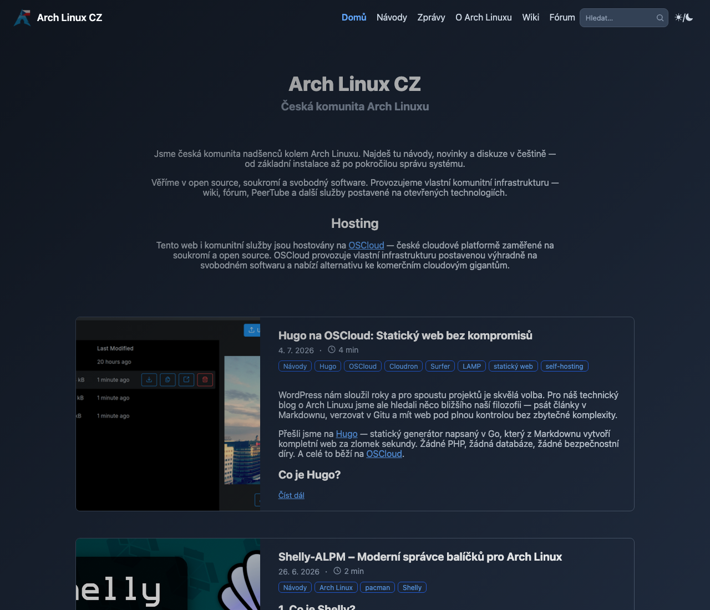
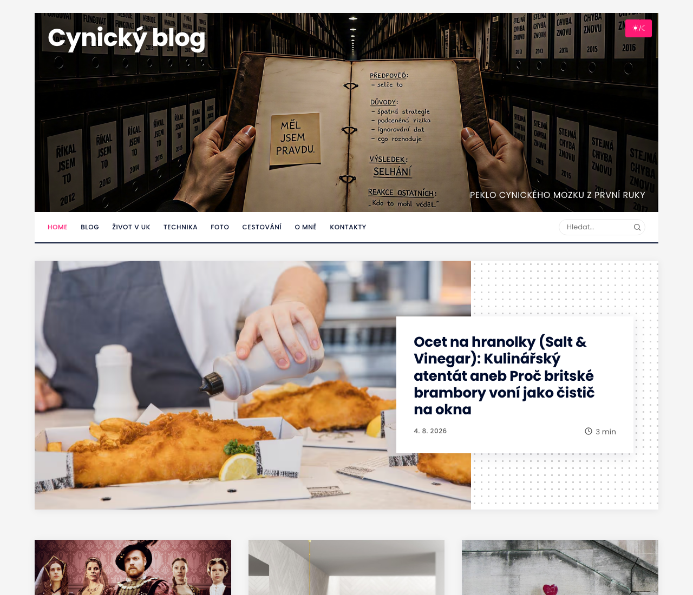

# Skinning blog.sh

Two sites in the wild wear a look the engine never shipped: one dressed as
a Hugo theme, one as Ghost. Neither forked the engine, neither edited a
template, and both survive `git pull` untouched. This guide is what those
two cost to build -- the mechanism first, then the three places where a
skin and the engine can quietly disagree, and last the checks that would
have caught every mistake made along the way.

It is not a CSS tutorial. Everything here is specific to this engine.

## What a skin is, and what it is not

A skin is one stylesheet of yours, loaded after the engine's own, that
repaints what is already on the page.

Before writing one, spend ten minutes with `./style.sh`. A surprising
amount of what looks like skinning is a setting: the colour palette (seven
shipped, or your own), the banner and what is written over it, the menu,
the sidebar and its widgets, whether a post opens with a lead image. A
site that only wants different colours does not want a skin at all -- it
wants a palette, and the palette keeps working when the engine changes.

Reach for a skin when the answer is "the same site, drawn differently":
other typography, other spacing, cards instead of rules, a masthead that
looks like somebody else's masthead. That is what a stylesheet loaded last
can do without owning anything.

## Where the skin lives

`site.extra_css` in `config/site.yml` -- one path, or a list of them,
loaded in order after `colors.css` and `site.css`:

```yaml
site:
  extra_css:
    - "/assets/css/skin.css"
```

Local paths only. Every page carries `style-src 'self'`, so a stylesheet
on another host would be dropped by the browser with no error you would
ever see -- the page would simply render undressed. The build refuses a
remote path out loud instead of letting that happen quietly.

The file is yours, in your working copy, and the engine never writes to
it. That is the whole reason this key exists: an edited `site.css` means a
merge conflict on every update, and the first conflict you resolve badly
is the one that silently drops a rule the engine added.

Note that the engine's `.gitignore` does not exclude stylesheets. Decide
which you want: commit the skin (it is part of your site, and a second
machine will need it), or exclude it locally if the site's repository is
public and the skin is not meant to be. Graphics are already excluded --
`assets/images/*` except the shipped defaults -- so a banner or a portrait
never rides along on an unrelated commit.

## The one rule: your stylesheet loads last

Everything else in this guide follows from it. Loading last means your
rules win at equal specificity -- including the rules the engine wrote for
narrow screens.

That is the trap, and it does not look like one, because on the machine
where the skin is written the phone is not on screen.

A worked example, from a real skin. The engine floats a table of contents
beside the article and, under 700px, stops floating it: the chapters go
back to being a block above the text, because at that width there is no
room beside anything. A skin gave the contents a percentage width to match
its own measure. On the desktop it was too wide and overhung the article.
The fix -- a fixed width and a mirrored gutter -- made the desktop right
and the phone absurd: the article came out 155px wide on a 390px screen,
because the skin's percentage was still winning below 700px, where the
engine had already said `width: auto` and meant it.

### Wrap an override in the range where it applies

```css
@media (min-width: 861px) {
  .toc { width: 350px; }
}
```

Below that, say nothing. The engine has a reflow for small screens and it
is the half of the stylesheet you have least reason to replace: it is
where the layout stops being decoration and starts being whether the text
fits. The cost of this rule is that a skin ends up with more media queries
than it feels like it should need. Pay it.

## Styling one page of a listing

CSS cannot read an address, so for a stylesheet the front page and
`/page/2/` used to be the same document -- which is why the two skins here
both wanted a lead card or a profile block on the first page and neither
could have one.

Since 1.3.2 a listing's `<body>` says which it is:

```css
.page-first .post-list-item:first-child { /* the lead card */ }
.page-cont  .archive-note { /* only on the continuations */ }
```

`page-first` is the page that lives at the listing's own address, `page-cont`
is everything under `/page/N/`, and both are emitted for every listing --
the front page, a tag, a series, a content type. A post page carries a bare
`<body>`, so a rule scoped to either class cannot leak onto one.

Two of them exist rather than one on purpose: a single mark on the
continuations would force you to write the first page's look
unconditionally and then take it back property by property, and a rule that
undoes another is the kind a later change quietly stops undoing. Scope
positively instead.

The pair says nothing about *which* listing you are on. That is already in
the markup: the front page's heading carries its own modifier, and a tag
listing names itself.

## Structures the engine leans on

Three rules in `site.css` are not decoration -- other things are built on
top of them. A skin may change all three, but it should know what it is
paying.

### The bar at z-index 5, and the switch beneath it at 3

`.wrap > nav` is `position: sticky` with `z-index: 5`; the back-to-top
button sits at 10 and the lightbox at 100, and the theme switch on the
banner sits at 3.

Unstick the bar -- a perfectly reasonable thing for a skin to want -- and
the theme switch can stop working while still looking fine. `.wrap` is a
grid, and on a grid item `z-index` takes effect **without** `position`.
The bar keeps its layer, its transparent padding still covers the corner
where the switch sits, and every click lands on the bar instead. Nothing
errors; the button simply does nothing.

If your skin moves the bar, give the switch a layer above it:

```css
#theme-toggle { z-index: 6; }
```

This exact bug shipped, and it was reported by somebody else. It survived
because the switch had been exercised by setting the theme directly rather
than by clicking it -- see *Checking a skin* below.

### The excerpt is a positioning context

`.content.excerpt` is `max-height: 500px; overflow: hidden; position:
relative`, with a gradient in `::after` that fades the cut edge.

The `position: relative` is load-bearing for the engine, and inconvenient
for a skin: an absolutely positioned `figure` inside a listing card anchors
itself to the excerpt, not to the card. If your cards put an image at an
edge, take the context off the excerpt in your own rules and turn the
gradient off with it -- a hard cut with no fade is honest, and a fade that
belongs to a box you no longer use is not.

### `max-width` on a flex item is not a cap on its contents

Putting `max-width` on a flex item that also has `flex-basis: 100%` does
not narrow the content -- it shrinks the item's hypothetical width, which
can let the line fit beside the item before it. In one skin the article
body ended up sitting next to its own meta line for exactly this reason.

Cap the children instead:

```css
.content > * { max-width: 62ch; }
```

## Checking a skin

The failures above have one thing in common: each was invisible in the way
the skin was being looked at.

**Click every control at least once, for real.** The theme switch, the
menu button on a phone width, an image that opens the lightbox, the search
field, the back-to-top button, and the share row under a post -- its
Mastodon button opens a question with an input and an error line, and
three of the controls are hidden until a script shows them. Setting state
directly -- flipping a data
attribute to photograph the dark theme -- proves the CSS and proves
nothing about whether the control is reachable.

**Measure at three widths, not one.** A wide desktop, something around the
breakpoint, and a phone. The engine's own reflow happens at 700px, so a
skin that has never been seen between 700px and its own breakpoint has an
untested range.

**Look at both schemes.** A skin that only defines colours for one of them
inherits the other from the palette, which is usually fine and
occasionally a white-on-white surprise.

Three traps in browser tooling, all of which have cost an afternoon here:

- A hidden preview panel reports `innerWidth: 0`, and every width and
  height measured through it is then nonsense -- text wrapping to a
  zero-width column, cards ten thousand pixels tall. Check `innerWidth`
  before believing any layout measurement.
- A screenshot does not wait for images to decode. A page photographed the
  instant it loads can show empty frames that are fine a moment later.
- The preview cache outlives a reload. A different origin
  (`127.0.0.1` instead of `localhost`) gets you one clean look; after
  that, version the stylesheet's address in the built page.

## Two skins that exist

| One engine, two skins |  |
| --- | --- |
|  |  |
| Hugo/Blowfish: compact bar, profile block, card list | Ghost: full-width lead card, dotted frame, tiles |

Neither picture has anything of the engine's own layout left on screen,
and neither site edited a template to get there. For comparison, the
engine's own look is in the [main README](../README.md).

Both are complete sites, and both deliberately differ from the thing they
imitate.

The Ghost-styled one is pure configuration plus one stylesheet: no
divergence from the engine at all, so updates are a `git pull` and a
rebuild. The Hugo-styled one goes further into layout -- a centred article
column with no sidebar, its own card geometry -- and still owns nothing
but its stylesheet.

Where they part from the original is worth copying as a habit. Search is a
field in the bar rather than a modal, because the engine's search is a
field and rebuilding it as a modal would mean owning behaviour. The
profile block on the home page is missing, because the engine has no such
region and inventing one means inventing its content too. Fidelity is not
the goal; a site that looks like it belongs to that family is.

## When a skin is the wrong tool

If you find yourself replacing structure rather than appearance -- moving
regions, adding a block the engine does not build, needing markup that
does not exist -- a stylesheet has stopped being the cheap option. At that
point editing the template is more honest, and you should know the price
you have just agreed to: every engine update can conflict there, and
`docs/decisions.md` explains what the templates promise and what they do
not.

The other honest answer is that the engine may simply be missing a
setting. If a skin has to fight a region into hiding, say so -- a switch
for a region is a reasonable thing to ask for, and cheaper for everyone
than the CSS that fights it.
